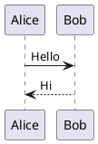

# PlantUML

PlantUML の記法で作成した図をコンテンツ内で扱うための Plugin です。

## 導入

```bash
npm install @riebeckite/plugin-plantuml
```

Plugin の export 名や設定項目は、実装と package README を正本として確認してください。Riebeckite の Plugin は `riebeckite.config.ts` の `plugins` に登録して利用します。

## 使用例

PlantUML のコードブロックを使って、シーケンス図などを記事と一緒に管理できます。

````markdown

````

PlantUML のコードブロックは、ビルド時に PlantUML サーバーの画像 URL を指す `` として出力されます。図の表示には、閲覧時にそのサーバーへ到達できる必要があります。

## 使いどころ

この Plugin が必要な場合だけ追加してください。Preset に含まれている場合は、同じ Plugin を重複して登録する必要はありません。

## 詳細仕様

設定項目、公開 API、制約、追加の使用例は [package README](../../../packages/plugins/plantuml/README.md) を参照してください。Plugin 全体の仕組みは [Plugin System](../framework/plugin-system.md)、Plugin を作る場合は [Writing a Plugin](./writing-a-plugin.md) を参照してください。
