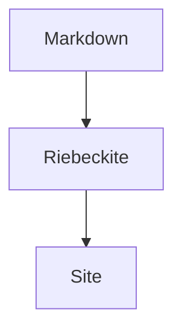

# Plugin Showcase

Plugin catalog は [Plugins](./README.md) にあります。このページでは、Plugin が実際に何を生成するかを示します。各例は GitHub でも読めるようコードフェンスで書いています。対応する Plugin を有効にして Riebeckite で公開すると、同じ source が Live Example になります。

## Obsidian Markdown

```md
> [!note]
> Callout の例です。

[[First Post]] への WikiLink。
```

## Code

### Code tabs — [`code-tabs`](../../../packages/plugins/code-tabs/README.md)

````md
```ts title="hello.ts"
console.log("hello")
```
````

## 図表

### Mermaid — [`mermaid`](../../../packages/plugins/mermaid/README.md)

````md

````

## ナレッジとデータ

### Query — [`query`](../../../packages/plugins/query/README.md)

````md
```query
filter:
  tags:
    any: [diary]
limit: 5
```
````

### Bases — [`bases`](../../../packages/plugins/bases/README.md)

````md
```base
filters:
  and:
    - file.hasTag("featured")
```
````

## コードフェンスだけでは示せない機能

次の Plugin は、画面やサイト全体に作用するため、1 つのコードフェンスでは表現できません。生成した `showcase` preset で確認できます。

| Plugin | 確認するもの |
| --- | --- |
| [`search`](../../../packages/plugins/search/README.md) | サイトを絞り込む検索ボックス |
| [`toc`](../../../packages/plugins/toc/README.md) | スクロール位置に追従する目次 |
| [`backlinks`](../../../packages/plugins/backlinks/README.md) | このノートを参照するノートの一覧 |
| [`garden-explorer`](../../../packages/plugins/garden-explorer/README.md) | graph と検索の explorer Page Type |
| [`taxonomy`](../../../packages/plugins/taxonomy/README.md) | tag と folder の一覧 Page Type |
| [`lightbox`](../../../packages/plugins/lightbox/README.md) | 画像を拡大する操作 |
| [`color-mode`](../../../packages/plugins/color-mode/README.md) | light / dark / system の切り替え |

## ほかの例

D2、Graphviz、Chart.js、Vega-Lite、WaveDrom、Markmap、Marp、Map、QR、Gallery、Dataview、Kanban などは、それぞれの package README と生成 scaffold のデモを参照してください。

- [Plugin catalog](./README.md)
- [Writing a Plugin](./writing-a-plugin.md)
- [Page System](../framework/page-system.md)
