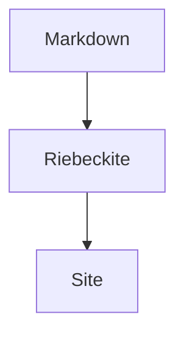

# Plugin Showcase

このページは、公式 Plugin の実例を置くための入口です。GitHub 上では安全に読めるようコードフェンスで示し、将来 `docs/` を Riebeckite で公開したときには Live Example として使える構造にします。

## Obsidian Markdown

```md
> [!note]
> Callout の例です。

[[First Post]] への WikiLink。
```

## Code Tabs

````md
```ts title="hello.ts"
console.log("hello")
```
````

## Mermaid

````md

````

## ほかの例

D2、Graphviz、Chart.js、Vega-Lite、WaveDrom、Markmap、Marp、Map、QR、Gallery、Dataview、Query、Bases、Kanban などは、それぞれの package README と生成 scaffold のデモを参照してください。

- [Plugin catalog](./README.md)
- [Writing a Plugin](./writing-a-plugin.md)
