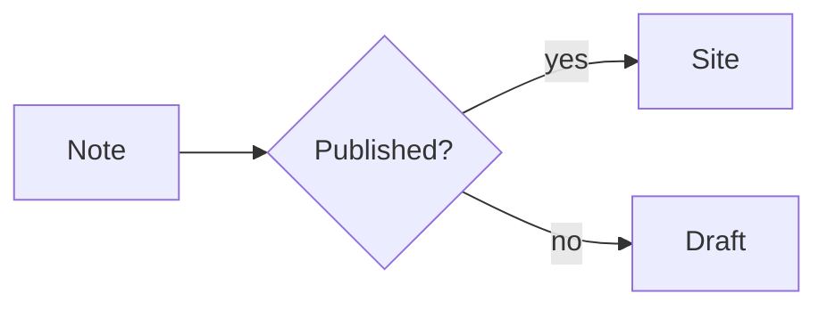
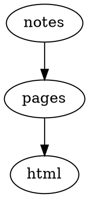

# Plugin Showcase

Plugin catalog は [Plugins](./README.md) にあります。このページでは、Plugin が実際に何を生成するかを確認できます。各項目では Markdown のソースと、Riebeckite 上での実行例を並べています。

> 生成される `showcase` preset では、ここにあるような例をローカルで確認できます。

## Obsidian Markdown

### Callouts — [`obsidian-markdown`](../../../packages/plugins/obsidian-markdown/README.md)

#### ソース

````md
> [!tip] 試してみる
> Callout は `[!type]` マーカー付きの block quote です。
> `[!info]`、`[!warning]`、`[!question]` も同じように表示されます。
````

#### 実行例

> [!tip] 試してみる
> Callout は `[!type]` マーカー付きの block quote です。
> `[!info]`、`[!warning]`、`[!question]` も同じように表示されます。

### WikiLinks と埋め込み — [`obsidian-markdown`](../../../packages/plugins/obsidian-markdown/README.md)

#### ソース

````md
[[README]] と [[plugins/README|Plugin catalog]] への WikiLink。
````

#### 実行例

[[README]] と [[plugins/README|Plugin catalog]] への WikiLink。

## Code

### Toolbar 付きコード — [`code-enhance`](../../../packages/plugins/code-enhance/README.md)

行番号、ファイル名バー、行ハイライト、copy button を確認できます。

#### ソース

````md
```ts title="hello.ts"
export function hello(name: string): string {
  return `こんにちは、${name}`;
}
```
````

#### 実行例

```ts title="hello.ts"
export function hello(name: string): string {
  return `こんにちは、${name}`;
}
```

### Code tabs — [`code-tabs`](../../../packages/plugins/code-tabs/README.md)

隣り合った `tab="..."` 付き code fence が、1 つの tab group になります。

#### ソース

````md
```ts tab="React"
const greeting = "Hello from React";
```

```js tab="Vanilla"
console.log("Hello from JavaScript");
```
````

#### 実行例

```ts tab="React"
const greeting = "Hello from React";
```

```js tab="Vanilla"
console.log("Hello from JavaScript");
```

## 図表

### Mermaid — [`mermaid`](../../../packages/plugins/mermaid/README.md)

#### ソース

````md

````

#### 実行例


### D2 — [`d2`](../../../packages/plugins/d2/README.md)

#### ソース

````md
```d2
site: Riebeckite
content -> build -> deploy
```
````

#### 実行例

```d2
site: Riebeckite
content -> build -> deploy
```

### Graphviz / DOT — [`graphviz`](../../../packages/plugins/graphviz/README.md)

#### ソース

````md

````

#### 実行例


### Chart.js — [`chartjs`](../../../packages/plugins/chartjs/README.md)

#### ソース

````md
```chart
{
  "type": "bar",
  "data": {
    "labels": ["Mon", "Tue", "Wed"],
    "datasets": [{ "label": "Visits", "data": [12, 19, 8] }]
  }
}
```
````

#### 実行例

```chart
{
  "type": "bar",
  "data": {
    "labels": ["Mon", "Tue", "Wed"],
    "datasets": [{ "label": "Visits", "data": [12, 19, 8] }]
  }
}
```

### Vega-Lite — [`vega-lite`](../../../packages/plugins/vega-lite/README.md)

#### ソース

````md
```vega-lite
{
  "title": "Revenue",
  "data": { "values": [{ "category": "A", "value": 28 }, { "category": "B", "value": 55 }] },
  "mark": "bar",
  "encoding": {
    "x": { "field": "category", "type": "nominal" },
    "y": { "field": "value", "type": "quantitative" }
  }
}
```
````

#### 実行例

```vega-lite
{
  "title": "Revenue",
  "data": { "values": [{ "category": "A", "value": 28 }, { "category": "B", "value": 55 }] },
  "mark": "bar",
  "encoding": {
    "x": { "field": "category", "type": "nominal" },
    "y": { "field": "value", "type": "quantitative" }
  }
}
```

### WaveDrom — [`wavedrom`](../../../packages/plugins/wavedrom/README.md)

#### ソース

````md
```wavedrom
{ "signal": [
  { "name": "clk", "wave": "p......" },
  { "name": "bus", "wave": "x.34.5x", "data": "head body tail" }
] }
```
````

#### 実行例

```wavedrom
{ "signal": [
  { "name": "clk", "wave": "p......" },
  { "name": "bus", "wave": "x.34.5x", "data": "head body tail" }
] }
```

### Markmap — [`markmap`](../../../packages/plugins/markmap/README.md)

#### ソース

````md
```markmap
# Project

## Design

### Notation
### Rendering

## Delivery
```
````

#### 実行例

```markmap
# Project

## Design

### Notation
### Rendering

## Delivery
```

### Marp slides — [`marp`](../../../packages/plugins/marp/README.md)

#### ソース

````md
```marp title="Intro deck"
# First slide

- a bullet

---

# Second slide
```
````

#### 実行例

```marp title="Intro deck"
# First slide

- a bullet

---

# Second slide
```

### Maps — [`map`](../../../packages/plugins/map/README.md)

静的な fallback を先に表示し、JavaScript が有効な環境では interactive map に拡張します。

#### ソース

````md
```map
center: 35.6812, 139.7671
zoom: 13
label: Tokyo Station
markers:
  - 35.6812, 139.7671 | Tokyo Station
  - 35.6586, 139.7454 | Tokyo Tower
```
````

#### 実行例

```map
center: 35.6812, 139.7671
zoom: 13
label: Tokyo Station
markers:
  - 35.6812, 139.7671 | Tokyo Station
  - 35.6586, 139.7454 | Tokyo Tower
```

### QR codes — [`qr-code`](../../../packages/plugins/qr-code/README.md)

Build 時に inline SVG として生成します。

#### ソース

````md
```qr
# caption: Project page
https://example.com/
```
````

#### 実行例

```qr
# caption: Project page
https://example.com/
```

## Media

### Rich embeds — [`rich-embed`](../../../packages/plugins/rich-embed/README.md)

URL を YouTube、Vimeo、Spotify、CodePen、Gist などの埋め込みに変換します。

#### ソース

````md
```embed
https://www.youtube.com/watch?v=dQw4w9WgXcQ
title: Demo video
caption: A short caption
aspect: 16/9
```
````

#### 実行例

```embed
https://www.youtube.com/watch?v=dQw4w9WgXcQ
title: Demo video
caption: A short caption
aspect: 16/9
```

### Gallery cards — [`gallery`](../../../packages/plugins/gallery/README.md)

#### ソース

````md
```gallery
columns: 3
items:
  - title: Default
    description: A clean, typographic theme.
    href: https://example.com/themes/default/
  - title: Minimal
    description: Stripped back to the essentials.
    href: https://example.com/themes/minimal/
  - title: Gruvbox
    description: A warm, high-contrast palette.
    href: https://example.com/themes/gruvbox/
```
````

#### 実行例

```gallery
columns: 3
items:
  - title: Default
    description: A clean, typographic theme.
    href: https://example.com/themes/default/
  - title: Minimal
    description: Stripped back to the essentials.
    href: https://example.com/themes/minimal/
  - title: Gruvbox
    description: A warm, high-contrast palette.
    href: https://example.com/themes/gruvbox/
```

## ナレッジとデータ

### Dataview — [`dataview`](../../../packages/plugins/dataview/README.md)

#### ソース

````md
```dataview
TABLE file.name AS "Name", status
FROM #project
WHERE status = "active"
SORT file.name asc
LIMIT 10
```
````

#### 実行例

```dataview
TABLE file.name AS "Name", status
FROM #project
WHERE status = "active"
SORT file.name asc
LIMIT 10
```

### Query — [`query`](../../../packages/plugins/query/README.md)

#### ソース

````md
```query
filter:
  tags:
    any: [diary]
sort:
  field: date
  order: desc
limit: 5
```
````

#### 実行例

```query
filter:
  tags:
    any: [diary]
sort:
  field: date
  order: desc
limit: 5
```

### Bases — [`bases`](../../../packages/plugins/bases/README.md)

#### ソース

````md
```base
filters:
  and:
    - file.hasTag("featured")
properties:
  file.name:
    displayName: Title
views:
  - type: table
    name: Featured
    limit: 10
```
````

#### 実行例

```base
filters:
  and:
    - file.hasTag("featured")
properties:
  file.name:
    displayName: Title
views:
  - type: table
    name: Featured
    limit: 10
```

### Kanban boards — [`kanban`](../../../packages/plugins/kanban/README.md)

本文に `##` 見出しの列と task list を置くと board になります。

#### ソース

````md
## Backlog

- [ ] Draft the release notes
- [ ] Link to [[README]]

## Done

- [x] Publish the fixture
````

#### 実行例

```kanban
## Backlog

- [ ] Draft the release notes
- [ ] Link to [[README]]

## Done

- [x] Publish the fixture
```

## コードフェンスだけでは示せない機能

次の Plugin は画面やサイト全体に作用するため、1 つの Markdown 断片だけでは表現しきれません。このページ上でも検索 box、目次、color mode toggle などとして確認できます。

| Plugin | 確認するもの |
| --- | --- |
| [`search`](../../../packages/plugins/search/README.md) | サイトを絞り込む検索ボックス |
| [`toc`](../../../packages/plugins/toc/README.md) | スクロール位置に追従する目次 |
| [`backlinks`](../../../packages/plugins/backlinks/README.md) | このノートを参照するノートの一覧 |
| [`garden-explorer`](../../../packages/plugins/garden-explorer/README.md) | graph と検索の explorer Page Type |
| [`taxonomy`](../../../packages/plugins/taxonomy/README.md) | tag と folder の一覧 Page Type |
| [`lightbox`](../../../packages/plugins/lightbox/README.md) | 画像を拡大する操作 |
| [`diff`](../../../packages/plugins/diff/README.md) / [`changelog`](../../../packages/plugins/changelog/README.md) | note ごとの git history |
| [`l10n`](../../../packages/plugins/l10n/README.md) | 翻訳ページ上の language switcher |
| [`color-mode`](../../../packages/plugins/color-mode/README.md) | light / dark / system の切り替え |

## 関連

- [Plugin catalog](./README.md)
- [Writing a Plugin](./writing-a-plugin.md)
- [Plugin API](../reference/plugin-api.md)
