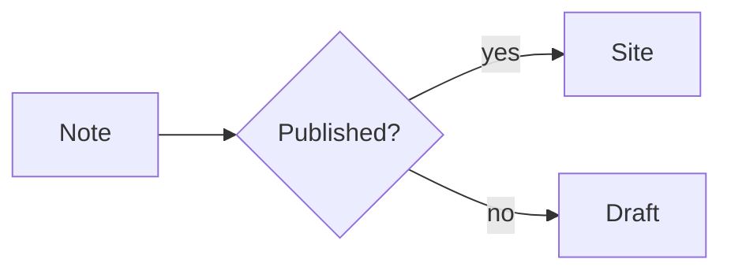
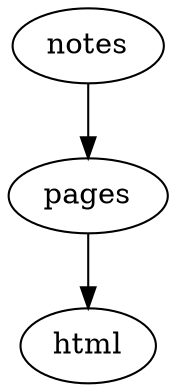

# showcase-ja

描画例・リファレンスページ・ローカルのフィクスチャで、Riebeckite のエコシステム全体を確認できる構成です。

## 含まれているもの

- **言語**: en, ja, zh-CN, es, de, fr, ko
- **テーマ**: `@riebeckite/theme-default`
- **プラグイン**（62 個）: `@riebeckite/plugin-obsidian-markdown`, `@riebeckite/plugin-color-mode`, `@riebeckite/plugin-l10n`, `@riebeckite/plugin-seo`, `@riebeckite/plugin-toc`, `@riebeckite/plugin-properties`, `@riebeckite/plugin-alias`, `@riebeckite/plugin-code-enhance`, `@riebeckite/plugin-search`, `@riebeckite/plugin-backlinks`, `@riebeckite/plugin-breadcrumbs`, `@riebeckite/plugin-navigation`, `@riebeckite/plugin-related-posts`, `@riebeckite/plugin-share`, `@riebeckite/plugin-changelog`, `@riebeckite/plugin-webmention`, `@riebeckite/plugin-recent-posts`, `@riebeckite/plugin-attachment`, `@riebeckite/plugin-pdf`, `@riebeckite/plugin-media`, `@riebeckite/plugin-responsive-image`, `@riebeckite/plugin-lightbox`, `@riebeckite/plugin-highlight`, `@riebeckite/plugin-code-tabs`, `@riebeckite/plugin-code-annotations`, `@riebeckite/plugin-shortcodes`, `@riebeckite/plugin-series`, `@riebeckite/plugin-taxonomy`, `@riebeckite/plugin-folder-pages`, `@riebeckite/plugin-autocardlink`, `@riebeckite/plugin-rich-embed`, `@riebeckite/plugin-gallery`, `@riebeckite/plugin-mermaid`, `@riebeckite/plugin-graphviz`, `@riebeckite/plugin-d2`, `@riebeckite/plugin-plantuml`, `@riebeckite/plugin-chartjs`, `@riebeckite/plugin-vega-lite`, `@riebeckite/plugin-wavedrom`, `@riebeckite/plugin-markmap`, `@riebeckite/plugin-map`, `@riebeckite/plugin-marp`, `@riebeckite/plugin-qr-code`, `@riebeckite/plugin-discord-embed`, `@riebeckite/plugin-excalidraw`, `@riebeckite/plugin-excalibrain`, `@riebeckite/plugin-canvas`, `@riebeckite/plugin-bases`, `@riebeckite/plugin-dataview`, `@riebeckite/plugin-flashcards`, `@riebeckite/plugin-kanban`, `@riebeckite/plugin-query`, `@riebeckite/plugin-local-graph`, `@riebeckite/plugin-hover-preview`, `@riebeckite/plugin-garden-explorer`, `@riebeckite/plugin-ux`, `@riebeckite/plugin-daily-notes`, `@riebeckite/plugin-rename`, `@riebeckite/plugin-text-fragment`, `@riebeckite/plugin-quality`, `@riebeckite/plugin-deploy`, `@riebeckite/plugin-diagnostics`
- **コンテンツページ**: /index, /framework/plugins, /framework/themes, /guide, /examples, /reference/plugins, /reference/themes

## 設定リファレンス

`riebeckite.config.ts` には、以下の全プラグインが全オプション付きで登録されています。これは出発点として使い、設定の仕様は[設定リファレンス](https://riebeckite.dev/docs/reference/configuration-reference)と各プラグインパッケージの README を確認してください。

- **テーマ**: `defaultTheme({ colorMode: "system", typography: "system", articleLayout: "article", userCss: [] })`

| Package | ファクトリ | オプション |
| --- | --- | --- |
| `@riebeckite/plugin-obsidian-markdown` | `obsidianMarkdown` | — |
| `@riebeckite/plugin-color-mode` | `colorModePlugin` | — |
| `@riebeckite/plugin-l10n` | `l10n` | `{ defaultLang: "ja", languages: ["en","ja","zh-CN","es","de","fr","ko"] }` |
| `@riebeckite/plugin-seo` | `seo` | `{ sitemap: true, robots: true, feed: { rss: true, atom: true, json: true } }` |
| `@riebeckite/plugin-toc` | `tocPlugin` | — |
| `@riebeckite/plugin-properties` | `properties` | `{ render: "slot", include: ["created", "modified", "tags", "status"], order: ["created", "modified", "tags", "status"] }` |
| `@riebeckite/plugin-alias` | `aliasPlugin` | `{ status: 308 }` |
| `@riebeckite/plugin-code-enhance` | `codeEnhance` | `{ lineNumbers: true, copyButton: true, filename: true, lineHighlight: true, diffHighlight: true, theme: { light: "github-light", dark: "github-dark" }, wrapToggle: true }` |
| `@riebeckite/plugin-search` | `searchPlugin` | — |
| `@riebeckite/plugin-backlinks` | `backlinksPlugin` | — |
| `@riebeckite/plugin-breadcrumbs` | `breadcrumbsPlugin` | — |
| `@riebeckite/plugin-navigation` | `navigation` | `{ items: [{ label: "Guide", href: "/guide" }, { label: "Examples", href: "/examples" }, { label: "Framework", href: "/framework/plugins", children: [{ label: "Plugins", href: "/framework/plugins" }, { label: "Themes", href: "/framework/themes" }] }], secondary: [{ label: "Guide", href: "/guide" }, { label: "Examples", href: "/examples" }] }` |
| `@riebeckite/plugin-related-posts` | `relatedPosts` | `{ limit: 5, useTags: true, useBacklinks: true, minScore: 1, heading: true, headingText: "Related", className: "rb-related-posts" }` |
| `@riebeckite/plugin-share` | `share` | `{ placement: "bottom", services: ["x", "bluesky", "mastodon", "facebook", "linkedin", "hatena", "copy"], mastodonInstance: "mastodon.social" }` |
| `@riebeckite/plugin-changelog` | `changelog` | `{ perNote: true, lookbackDays: 90, dateFormat: "iso", siteWide: false }` |
| `@riebeckite/plugin-webmention` | `webmention` | `{ headingText: "Mentions", limit: 20 }` |
| `@riebeckite/plugin-recent-posts` | `recentPostsPlugin` | — |
| `@riebeckite/plugin-attachment` | `attachment` | `{ showSize: true }` |
| `@riebeckite/plugin-pdf` | `pdf` | `{ height: "640px", initialPage: 1, toolbar: true, showMetadata: true, downloadLabel: "Download PDF" }` |
| `@riebeckite/plugin-media` | `media` | `{ preload: "metadata", lazy: true, showCaption: true, showDownload: false, showOpenOriginal: true }` |
| `@riebeckite/plugin-responsive-image` | `responsiveImage` | `{ lazy: true, decoding: true, sizes: "100vw", widths: [640, 1280, 1920], formats: ["webp", "avif"], className: "rb-responsive-image" }` |
| `@riebeckite/plugin-lightbox` | `lightboxPlugin` | `{ selectorClass: "rr-lightbox-trigger" }` |
| `@riebeckite/plugin-highlight` | `highlight` | `{ tag: "mark", className: "rb-mark" }` |
| `@riebeckite/plugin-code-tabs` | `codeTabs` | `{ syncTabs: true }` |
| `@riebeckite/plugin-code-annotations` | `codeAnnotations` | `{ className: "rb-code" }` |
| `@riebeckite/plugin-shortcodes` | `shortcodes` | `{ builtins: true }` |
| `@riebeckite/plugin-series` | `series` | `{ key: "series", orderKey: "series_order", titleKey: "series_title", positionLabel: false, heading: true, className: "rb-series" }` |
| `@riebeckite/plugin-taxonomy` | `taxonomy` | `{ tags: true, folders: true, related: true, feeds: { rss: true, atom: true, json: true }, relatedLimit: 8 }` |
| `@riebeckite/plugin-folder-pages` | `folderPagesPlugin` | — |
| `@riebeckite/plugin-autocardlink` | `autoCardLinkPlugin` | `{ className: "rb-cardlink" }` |
| `@riebeckite/plugin-rich-embed` | `richEmbed` | `{ providers: ["youtube", "vimeo", "spotify"] }` |
| `@riebeckite/plugin-gallery` | `gallery` | `{ columns: 3, aspect: "4/3", language: "gallery" }` |
| `@riebeckite/plugin-mermaid` | `mermaid` | `{ render: "build", theme: { light: "default", dark: "dark" }, caption: true, fallback: true }` |
| `@riebeckite/plugin-graphviz` | `graphviz` | `{ render: "build", engine: "dot", caption: true, fallback: true }` |
| `@riebeckite/plugin-d2` | `d2` | `{ render: "build", theme: { light: 0, dark: 1 }, layout: "dagre", caption: true }` |
| `@riebeckite/plugin-plantuml` | `plantuml` | `{ server: "https://www.plantuml.com/plantuml", format: "svg", caption: true, fallback: true }` |
| `@riebeckite/plugin-chartjs` | `chartjs` | `{ responsive: true, caption: true, className: "rb-chartjs" }` |
| `@riebeckite/plugin-vega-lite` | `vegaLite` | `{ caption: true, theme: "light", renderer: "canvas", actions: false, className: "rb-vega-lite" }` |
| `@riebeckite/plugin-wavedrom` | `wavedrom` | `{ skin: "default", caption: true, fallback: true, className: "rb-wavedrom" }` |
| `@riebeckite/plugin-markmap` | `markmap` | `{ caption: true, height: 320, colorFreezeLevel: 2 }` |
| `@riebeckite/plugin-map` | `map` | `{ zoom: 13, height: 320, tileUrl: "https://tile.openstreetmap.org/{z}/{x}/{y}.png", attribution: "&copy; <a href=\"https://www.openstreetmap.org/copyright\">OpenStreetMap</a> contributors" }` |
| `@riebeckite/plugin-marp` | `marp` | `{ theme: "default", allowHtml: true, math: true, caption: true }` |
| `@riebeckite/plugin-qr-code` | `qrCode` | `{ level: "M", margin: 1, width: 160, dark: "#000000", light: "#ffffff", caption: true, className: "rb-qr" }` |
| `@riebeckite/plugin-discord-embed` | `discordEmbed` | `{ themeColor: "#5865F2", imageAlt: true, imageDimensions: true }` |
| `@riebeckite/plugin-excalidraw` | `excalidraw` | `{ lazy: true }` |
| `@riebeckite/plugin-excalibrain` | `excaliBrain` | `{ render: "build", auto: true, heading: true, infer: true, siblings: true, headingText: "ExcaliBrain", width: 720, height: 480 }` |
| `@riebeckite/plugin-canvas` | `canvas` | `{ language: "canvas", render: "both", className: "rb-canvas" }` |
| `@riebeckite/plugin-bases` | `bases` | `{ language: "base", limit: 100, className: "rb-bases", showFallback: true }` |
| `@riebeckite/plugin-dataview` | `dataviewPlugin` | `{ limit: 50, className: "rb-dataview", hideFallback: false }` |
| `@riebeckite/plugin-flashcards` | `flashcardsPlugin` | `{ shuffle: true, fallback: true, className: "rb-flashcards" }` |
| `@riebeckite/plugin-kanban` | `kanban` | `{ columnMarker: "##", autoDetect: true, className: "rb-kanban", fallback: true }` |
| `@riebeckite/plugin-query` | `queryPlugin` | `{ defaultFormat: "list", defaultLimit: 50, className: "rb-query", excludeSelf: true }` |
| `@riebeckite/plugin-local-graph` | `localGraphPlugin` | — |
| `@riebeckite/plugin-hover-preview` | `hoverPreviewPlugin` | `{ delay: 120, excerptLength: 160, selector: 'a[href^="/"]', includeTitles: true }` |
| `@riebeckite/plugin-garden-explorer` | `gardenExplorerPlugin` | — |
| `@riebeckite/plugin-ux` | `uxPlugin` | `{ progress: true, backToTop: true, tocScrollSpy: true, codeCopy: true }` |
| `@riebeckite/plugin-daily-notes` | `dailyNotesPlugin` | `{ source: { directory: "Daily", pathPattern: "Daily/{YYYY}-{MM}-{DD}" }, extract: { frontmatter: "daily-summary", codeBlock: "daily-snippet" }, widget: { limit: 5 } }` |
| `@riebeckite/plugin-rename` | `renamePlugin` | `{ enabled: true, status: 308, onUnexpectedRemoval: "warning" }` |
| `@riebeckite/plugin-text-fragment` | `textFragmentPlugin` | `{ prefix: "showcase-ja: " }` |
| `@riebeckite/plugin-quality` | `qualityPlugin` | `{ a11y: { enabled: true }, ignoreRules: [] }` |
| `@riebeckite/plugin-deploy` | `deployPlugin` | `{ provider: "cloudflare-pages" }` |
| `@riebeckite/plugin-diagnostics` | `diagnostics` | `{ reportUnusedAssets: true, reportOrphans: true, requiredFrontmatter: ["title"] }` |

## コマンド

```sh
npm install
npm exec riebeckite check
npm exec riebeckite dev
npm exec riebeckite build
```

## 最初に編集する場所

- `content/index.md`: 最初に公開されるページです。
- `riebeckite.config.ts`: `site.title`、`site.baseUrl`、`content.directory` を設定します。
- `public/favicon.ico`: 必要になったらサイトアイコンを置き換えます。

## デモを試す

生成されたサイトには、各機能を体験できるコンテンツページが含まれています:

- [**プラグインツアー**](content/framework/plugins.md) — live at [`/framework/plugins/`](/framework/plugins/)
- [**テーマツアー**](content/framework/themes.md) — live at [`/framework/themes/`](/framework/themes/)
- [**はじめにガイド**](content/guide.en.md) — live at [`/guide/`](/guide/)
- [**サンプル集**](content/examples.md) — live at [`/examples/`](/examples/)
- [**プラグインリファレンス**](content/reference/plugins.en.md) — live at [`/reference/plugins/`](/reference/plugins/)
- [**テーマリファレンス**](content/reference/themes.en.md) — live at [`/reference/themes/`](/reference/themes/)

## コピーして使えるデモ

以下のスニペットを `content/` 配下の Markdown ファイルに貼り付けて `npm exec riebeckite dev` を実行してください。それぞれ、このプリセットが登録しているプラグインでレンダリングされます。

### コールアウト

`[!type]` マーカー付きブロック引用をスタイル付きパネルに変換します。

> [!tip] Try it
> A callout is a block quote with a `[!type]` marker. `[!info]`,
> `[!warning]`, and `[!question]` render the same way.

### ウィキリンクと埋め込み

`[[...]]` リンクと `![[...]]` 埋め込みは、コンテンツマニフェストから実際のパーマリンクへ解決されます。

Read the [[guide]] and [[index]] pages. `![[index]]` embeds the note inline.

### ツールバー付きコード

コードフェンスに行番号・ファイル名バー・行ハイライト・コピーボタンが付きます。

```ts
// Syntax highlighting, line numbers, and a copy button
export function hello(name: string): string {
  return "Hello, " + name + "!";
}
```

### タブ切り替えコード

隣り合う `tab="..."` フェンスがタブグループになります。`syncTabs: true` でページ内の同じラベルを同期できます。

```ts tab="React"
const greeting = "Hello from React";
```
```js tab="Vanilla"
console.log("Hello from JavaScript");
```

### Mermaid

`mermaid` フェンスはビルド時にレンダリングされた図になります。



### D2

`d2` フェンスが SVG 図にコンパイルされます。

```d2
site: Riebeckite
  content -> build -> deploy
```

### Graphviz / DOT

`dot` フェンスが指定のエンジン（ここでは `dot`）でレンダリングされます。



### Chart.js

`chart` JSON フェンスが Chart.js で描画されます。キャプションはブロックの `title` から取られます。

```chart
{
  "type": "bar",
  "data": {
    "labels": ["Mon", "Tue", "Wed"],
    "datasets": [{ "label": "Visits", "data": [12, 19, 8] }]
  }
}
```

### Vega-Lite

`vega-lite` の JSON 仕様が Vega チャートになります。

```vega-lite
{
  "title": "Revenue",
  "data": {
    "values": [
      { "category": "A", "value": 28 },
      { "category": "B", "value": 55 }
    ]
  },
  "mark": "bar",
  "encoding": {
    "x": { "field": "category", "type": "nominal" },
    "y": { "field": "value", "type": "quantitative" }
  }
}
```

### WaveDrom

`wavedrom` JSON フェンスがデジタルタイミング図になります。

```wavedrom
{
  "signal": [
    { "name": "clk", "wave": "p......" },
    { "name": "bus", "wave": "x.34.5x", "data": "head body tail" }
  ]
}
```

### Markmap

`markmap` フェンスの見出し構成がインタラクティブなマインドマップになります。

```markmap
# Project

## Design

### Notation
### Rendering

## Delivery
```

### 地図

`map` フェンスが OpenStreetMap を埋め込みます。まず静的なフォールバック（座標とリンク）を表示し、JavaScript がある場合はインタラクティブな地図に拡張します。

```map
center: 35.6812, 139.7671
zoom: 13
label: Tokyo Station
markers:
  - 35.6812, 139.7671 | Tokyo Station
  - 35.6586, 139.7454 | Tokyo Tower
```

### Marp スライド

`marp` フェンスがスライドとして描画されます。スライドは `---` で区切ります。

```marp title="Intro deck"
# First slide

- a bullet

---

# Second slide
```

### QR コード

`qr` フェンスがインライン SVG の QR コードになります（ビルド時に全てエンコードされます）。

```qr
# caption: Project page
https://example.com/
```

### リッチ埋め込み

`embed` フェンスの URL が YouTube・Vimeo・Spotify・CodePen・Gist の埋め込みになります。

```embed
https://www.youtube.com/watch?v=dQw4w9WgXcQ
title: Demo video
caption: A short caption
aspect: 16/9
```

### ギャラリーカード

`gallery` の YAML フェンスがレスポンシブなカードグリッドを描画します。テーマやプロジェクトの紹介に便利です。

```gallery
columns: 3
items:
  - title: Default
    description: A clean, typographic theme.
    meta: v0.0.5
    href: https://riebeckite.dev/docs/themes/default
  - title: Minimal
    description: Stripped back to the essentials.
    meta: v0.0.5
    href: https://riebeckite.dev/docs/themes/minimal
  - title: Gruvbox
    description: A warm, high-contrast palette.
    meta: v0.0.5
    href: https://riebeckite.dev/docs/themes/gruvbox
```

### Dataview

`dataview` クエリがマニフェストからノート一覧を描画します。

```dataview
TABLE file.name AS "Name", status
FROM #project
WHERE status = "active"
SORT file.name asc
LIMIT 10
```

### Query

`query` フェンスの YAML でマニフェストのエントリを絞り込み・並べ替えできます。

```query
filter:
  tags:
    any: [diary]
sort:
  field: date
  order: desc
limit: 5
```

### Base ビュー

`base` YAML フェンスが Base のテーブルビューを描画します。

```base
filters:
  and:
    - file.hasTag("featured")
properties:
  file.name:
    displayName: Title
views:
  - type: table
    name: Featured
    limit: 10
```

### カンバンボード

本文が `##` 列とタスクリストでできたノートはボードになります。カード内では `#タグ` や `[[ウィキリンク]]` も使えます。

```md
## Backlog

- [ ] Draft the release notes
- [ ] Link to [[index]]

## Done

- [x] Publish the fixture
```

## ローカライズ

コンテンツは `content/` にプレーンな Markdown として置きます。翻訳ページは既定ファイルの隣に `<base>.<lang>.md` の規則で配置します（`about.ja.md`、`about.en.md` など）。既定言語は接尾辞なしのパス、それ以外は `/lang/` のパスで配信されます。言語の追加・削除は `riebeckite.config.ts` の `l10n(...)` プラグインを編集し、対応する翻訳ファイルを追加・削除してください。

## 拡張

プラグインとテーマは `riebeckite.config.ts` で登録します。パッケージをインストールし、ファクトリを import して `plugins` 配列に追加するか、`theme` を別のテーマファクトリに変更します。全プラグイン・テーマの一覧は Riebeckite リポジトリを参照してください。

- ドキュメント: [English](https://github.com/Rerurate514/riebeckite/blob/main/docs/README.md)
  · [日本語](https://github.com/Rerurate514/riebeckite/blob/main/docs/README.ja.md)
