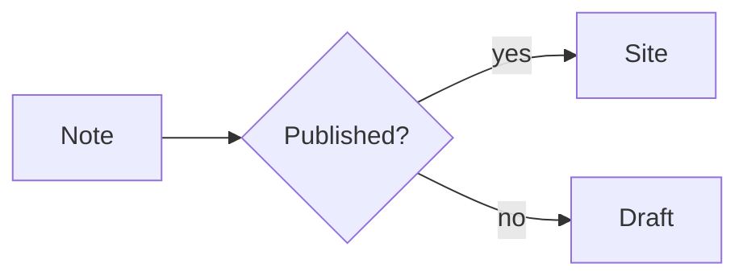
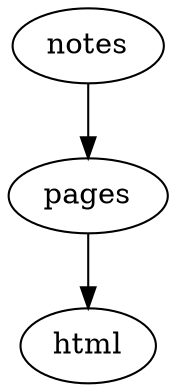
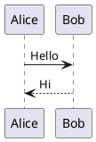

# Examples

Rendered examples for the diagram, chart, and code features in this preset. Fenced code blocks are turned into output at build time by the relevant plugins, while code blocks gain toolbars from the code plugins. Each section below is copy-pasteable into a Markdown document.

## Callouts

A block quote with a `[!type]` marker becomes a styled callout panel.

> [!tip] Try it
> A callout is a block quote with a `[!type]` marker. `[!info]`,
> `[!warning]`, and `[!question]` render the same way.

## Wikilinks and embeds

`[[...]]` links and `![[...]]` embeds resolve to real permalinks from the content manifest.

Read the [[guide]] and [[index]] pages. `![[index]]` embeds the note inline.

## Code with a toolbar

Code fences get line numbers, a filename bar, line highlighting, and a copy button.

```ts
// Syntax highlighting, line numbers, and a copy button
export function hello(name: string): string {
  return "Hello, " + name + "!";
}
```

## Code tabs

Adjacent `tab="..."` fences become one tabbed group; `syncTabs: true` keeps the same label in sync across groups.

```ts tab="React"
const greeting = "Hello from React";
```
```js tab="Vanilla"
console.log("Hello from JavaScript");
```

## Mermaid

A `mermaid` fence becomes a rendered diagram at build time.



## D2

A `d2` fence is compiled into an SVG diagram.

```d2
site: Riebeckite
  content -> build -> deploy
```

## Graphviz / DOT

A `dot` fence is rendered with a configurable engine (here `dot`).



## Chart.js

A `chart` JSON fence renders with Chart.js; a caption comes from the block `title`.

```chart
{
  "type": "bar",
  "data": {
    "labels": ["Mon", "Tue", "Wed"],
    "datasets": [{ "label": "Visits", "data": [12, 19, 8] }]
  }
}
```

## Vega-Lite

A `vega-lite` JSON specification becomes a Vega chart.

```vega-lite
{
  "title": "Revenue",
  "data": {
    "values": [
      { "category": "A", "value": 28 },
      { "category": "B", "value": 55 }
    ]
  },
  "mark": "bar",
  "encoding": {
    "x": { "field": "category", "type": "nominal" },
    "y": { "field": "value", "type": "quantitative" }
  }
}
```

## WaveDrom

A `wavedrom` JSON fence becomes a digital timing diagram.

```wavedrom
{
  "signal": [
    { "name": "clk", "wave": "p......" },
    { "name": "bus", "wave": "x.34.5x", "data": "head body tail" }
  ]
}
```

## Markmap

A `markmap` fence turns its heading outline into an interactive mind map.

```markmap
# Project

## Design

### Notation
### Rendering

## Delivery
```

## Maps

A `map` fence embeds an OpenStreetMap: a static fallback (coordinates and links) first, upgraded to an interactive map when JavaScript is available.

```map
center: 35.6812, 139.7671
zoom: 13
label: Tokyo Station
markers:
  - 35.6812, 139.7671 | Tokyo Station
  - 35.6586, 139.7454 | Tokyo Tower
```

## Marp slides

A `marp` fence renders slides, separated by `---`.

```marp title="Intro deck"
# First slide

- a bullet

---

# Second slide
```

## QR codes

A `qr` fence becomes an inline SVG QR code, encoded entirely at build time.

```qr
# caption: Project page
https://example.com/
```

## Rich embeds

An `embed` fence turns a URL into a YouTube, Vimeo, Spotify, CodePen, or Gist embed.

```embed
https://www.youtube.com/watch?v=dQw4w9WgXcQ
title: Demo video
caption: A short caption
aspect: 16/9
```

## Gallery cards

A `gallery` YAML fence renders a responsive grid of cards — handy for theme or project showcases.

```gallery
columns: 3
items:
  - title: Default
    description: A clean, typographic theme.
    meta: v0.0.5
    href: https://example.com/themes/default/
  - title: Minimal
    description: Stripped back to the essentials.
    meta: v0.0.5
    href: https://example.com/themes/minimal/
  - title: Gruvbox
    description: A warm, high-contrast palette.
    meta: v0.0.5
    href: https://example.com/themes/gruvbox/
```

## Dataview

A `dataview` query renders a table of notes from the manifest.

```dataview
TABLE file.name AS "Name", status
FROM #project
WHERE status = "active"
SORT file.name asc
LIMIT 10
```

## Query

A `query` fence is YAML that filters and sorts entries from the manifest.

```query
filter:
  tags:
    any: [diary]
sort:
  field: date
  order: desc
limit: 5
```

## Base views

A `base` YAML fence renders a Base table view.

```base
filters:
  and:
    - file.hasTag("featured")
properties:
  file.name:
    displayName: Title
views:
  - type: table
    name: Featured
    limit: 10
```

## Kanban boards

A note whose body is `##` columns of task lists becomes a board; `#tags` and `[[wikilinks]]` work inside cards.

```md
## Backlog

- [ ] Draft the release notes
- [ ] Link to [[index]]

## Done

- [x] Publish the fixture
```

## plantuml

A `plantuml` fence is rendered to SVG through the configured PlantUML server.



## excalidraw

Embeds Excalidraw drawings referenced from Markdown.

![[Architecture.excalidraw]]


## canvas

Embeds Obsidian Canvas JSON as a rendered canvas/fallback.

```canvas
{ "nodes": [], "edges": [] }
```

## flashcards

Turns Q/A style Markdown into flashcards.

# Flashcards

Q: What is Riebeckite?
A: A content-first static site framework.

---

What does SSG mean?::Static Site Generation
