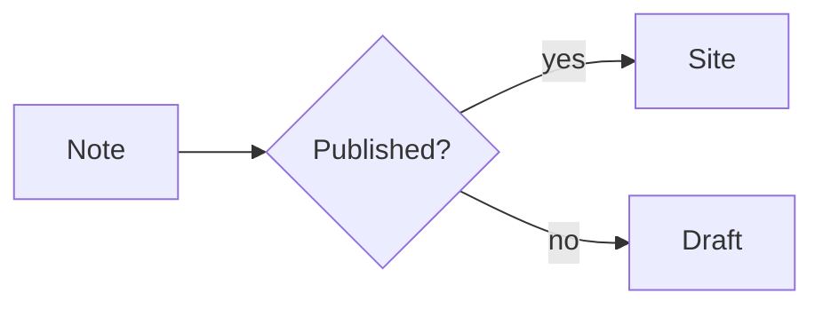
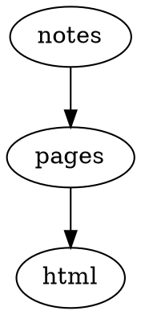
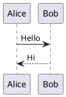

# サンプル集

このプリセットに含まれる図表・チャート・コード機能の描画例です。フェンス付きコードブロックは対応するプラグインによりビルド時に出力へ変換され、コードブロックにはツールバーが付きます。以下の各セクションは、Markdown 文書にそのままコピーして使えます。

## コールアウト

`[!type]` マーカー付きブロック引用をスタイル付きパネルに変換します。

> [!tip] Try it
> A callout is a block quote with a `[!type]` marker. `[!info]`,
> `[!warning]`, and `[!question]` render the same way.

## ウィキリンクと埋め込み

`[[...]]` リンクと `![[...]]` 埋め込みは、コンテンツマニフェストから実際のパーマリンクへ解決されます。

Read the [[guide]] and [[index]] pages. `![[index]]` embeds the note inline.

## ツールバー付きコード

コードフェンスに行番号・ファイル名バー・行ハイライト・コピーボタンが付きます。

```ts
// Syntax highlighting, line numbers, and a copy button
export function hello(name: string): string {
  return "Hello, " + name + "!";
}
```

## タブ切り替えコード

隣り合う `tab="..."` フェンスがタブグループになります。`syncTabs: true` でページ内の同じラベルを同期できます。

```ts tab="React"
const greeting = "Hello from React";
```
```js tab="Vanilla"
console.log("Hello from JavaScript");
```

## Mermaid

`mermaid` フェンスはビルド時にレンダリングされた図になります。



## D2

`d2` フェンスが SVG 図にコンパイルされます。

```d2
site: Riebeckite
  content -> build -> deploy
```

## Graphviz / DOT

`dot` フェンスが指定のエンジン（ここでは `dot`）でレンダリングされます。



## Chart.js

`chart` JSON フェンスが Chart.js で描画されます。キャプションはブロックの `title` から取られます。

```chart
{
  "type": "bar",
  "data": {
    "labels": ["Mon", "Tue", "Wed"],
    "datasets": [{ "label": "Visits", "data": [12, 19, 8] }]
  }
}
```

## Vega-Lite

`vega-lite` の JSON 仕様が Vega チャートになります。

```vega-lite
{
  "title": "Revenue",
  "data": {
    "values": [
      { "category": "A", "value": 28 },
      { "category": "B", "value": 55 }
    ]
  },
  "mark": "bar",
  "encoding": {
    "x": { "field": "category", "type": "nominal" },
    "y": { "field": "value", "type": "quantitative" }
  }
}
```

## WaveDrom

`wavedrom` JSON フェンスがデジタルタイミング図になります。

```wavedrom
{
  "signal": [
    { "name": "clk", "wave": "p......" },
    { "name": "bus", "wave": "x.34.5x", "data": "head body tail" }
  ]
}
```

## Markmap

`markmap` フェンスの見出し構成がインタラクティブなマインドマップになります。

```markmap
# Project

## Design

### Notation
### Rendering

## Delivery
```

## 地図

`map` フェンスが OpenStreetMap を埋め込みます。まず静的なフォールバック（座標とリンク）を表示し、JavaScript がある場合はインタラクティブな地図に拡張します。

```map
center: 35.6812, 139.7671
zoom: 13
label: Tokyo Station
markers:
  - 35.6812, 139.7671 | Tokyo Station
  - 35.6586, 139.7454 | Tokyo Tower
```

## Marp スライド

`marp` フェンスがスライドとして描画されます。スライドは `---` で区切ります。

```marp title="Intro deck"
# First slide

- a bullet

---

# Second slide
```

## QR コード

`qr` フェンスがインライン SVG の QR コードになります（ビルド時に全てエンコードされます）。

```qr
# caption: Project page
https://example.com/
```

## リッチ埋め込み

`embed` フェンスの URL が YouTube・Vimeo・Spotify・CodePen・Gist の埋め込みになります。

```embed
https://www.youtube.com/watch?v=dQw4w9WgXcQ
title: Demo video
caption: A short caption
aspect: 16/9
```

## ギャラリーカード

`gallery` の YAML フェンスがレスポンシブなカードグリッドを描画します。テーマやプロジェクトの紹介に便利です。

```gallery
columns: 3
items:
  - title: Default
    description: A clean, typographic theme.
    meta: v0.0.5
    href: https://riebeckite.dev/docs/themes/default
  - title: Minimal
    description: Stripped back to the essentials.
    meta: v0.0.5
    href: https://riebeckite.dev/docs/themes/minimal
  - title: Gruvbox
    description: A warm, high-contrast palette.
    meta: v0.0.5
    href: https://riebeckite.dev/docs/themes/gruvbox
```

## Dataview

`dataview` クエリがマニフェストからノート一覧を描画します。

```dataview
TABLE file.name AS "Name", status
FROM #project
WHERE status = "active"
SORT file.name asc
LIMIT 10
```

## Query

`query` フェンスの YAML でマニフェストのエントリを絞り込み・並べ替えできます。

```query
filter:
  tags:
    any: [diary]
sort:
  field: date
  order: desc
limit: 5
```

## Base ビュー

`base` YAML フェンスが Base のテーブルビューを描画します。

```base
filters:
  and:
    - file.hasTag("featured")
properties:
  file.name:
    displayName: Title
views:
  - type: table
    name: Featured
    limit: 10
```

## カンバンボード

本文が `##` 列とタスクリストでできたノートはボードになります。カード内では `#タグ` や `[[ウィキリンク]]` も使えます。

```md
## Backlog

- [ ] Draft the release notes
- [ ] Link to [[index]]

## Done

- [x] Publish the fixture
```

## plantuml

A `plantuml` fence is rendered to SVG through the configured PlantUML server.



## excalidraw

Embeds Excalidraw drawings referenced from Markdown.

![[Architecture.excalidraw]]


## canvas

Embeds Obsidian Canvas JSON as a rendered canvas/fallback.

```canvas
{ "nodes": [], "edges": [] }
```

## flashcards

Turns Q/A style Markdown into flashcards.

# Flashcards

Q: What is Riebeckite?
A: A content-first static site framework.

---

What does SSG mean?::Static Site Generation
