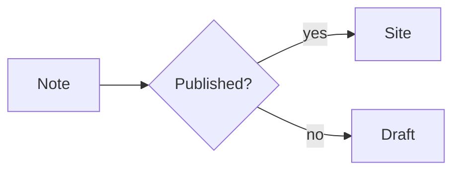
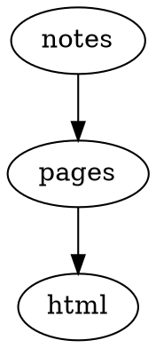

# showcase

Explore the complete Riebeckite ecosystem with rendered examples, reference pages, and local fixtures.

## What's included

- **Languages**: en, ja, zh-CN, es, de, fr, ko
- **Theme**: `@riebeckite/theme-default`
- **Plugins** (62): `@riebeckite/plugin-obsidian-markdown`, `@riebeckite/plugin-color-mode`, `@riebeckite/plugin-l10n`, `@riebeckite/plugin-seo`, `@riebeckite/plugin-toc`, `@riebeckite/plugin-properties`, `@riebeckite/plugin-alias`, `@riebeckite/plugin-code-enhance`, `@riebeckite/plugin-search`, `@riebeckite/plugin-backlinks`, `@riebeckite/plugin-breadcrumbs`, `@riebeckite/plugin-navigation`, `@riebeckite/plugin-related-posts`, `@riebeckite/plugin-share`, `@riebeckite/plugin-changelog`, `@riebeckite/plugin-webmention`, `@riebeckite/plugin-recent-posts`, `@riebeckite/plugin-attachment`, `@riebeckite/plugin-pdf`, `@riebeckite/plugin-media`, `@riebeckite/plugin-responsive-image`, `@riebeckite/plugin-lightbox`, `@riebeckite/plugin-highlight`, `@riebeckite/plugin-code-tabs`, `@riebeckite/plugin-code-annotations`, `@riebeckite/plugin-shortcodes`, `@riebeckite/plugin-series`, `@riebeckite/plugin-taxonomy`, `@riebeckite/plugin-folder-pages`, `@riebeckite/plugin-autocardlink`, `@riebeckite/plugin-rich-embed`, `@riebeckite/plugin-gallery`, `@riebeckite/plugin-mermaid`, `@riebeckite/plugin-graphviz`, `@riebeckite/plugin-d2`, `@riebeckite/plugin-plantuml`, `@riebeckite/plugin-chartjs`, `@riebeckite/plugin-vega-lite`, `@riebeckite/plugin-wavedrom`, `@riebeckite/plugin-markmap`, `@riebeckite/plugin-map`, `@riebeckite/plugin-marp`, `@riebeckite/plugin-qr-code`, `@riebeckite/plugin-discord-embed`, `@riebeckite/plugin-excalidraw`, `@riebeckite/plugin-excalibrain`, `@riebeckite/plugin-canvas`, `@riebeckite/plugin-bases`, `@riebeckite/plugin-dataview`, `@riebeckite/plugin-flashcards`, `@riebeckite/plugin-kanban`, `@riebeckite/plugin-query`, `@riebeckite/plugin-local-graph`, `@riebeckite/plugin-hover-preview`, `@riebeckite/plugin-garden-explorer`, `@riebeckite/plugin-ux`, `@riebeckite/plugin-daily-notes`, `@riebeckite/plugin-rename`, `@riebeckite/plugin-text-fragment`, `@riebeckite/plugin-quality`, `@riebeckite/plugin-deploy`, `@riebeckite/plugin-diagnostics`
- **Content pages**: /index, /framework/plugins, /framework/themes, /guide, /examples, /reference/plugins, /reference/themes

## Configuration reference

`riebeckite.config.ts` already registers every plugin below with its full option set — the file doubles as the settings reference. Every option is documented in the plugin's package README.

- **Theme**: `defaultTheme({ colorMode: "system", typography: "system", articleLayout: "article", userCss: [] })`

| Package | Factory | Options |
| --- | --- | --- |
| `@riebeckite/plugin-obsidian-markdown` | `obsidianMarkdown` | — |
| `@riebeckite/plugin-color-mode` | `colorModePlugin` | — |
| `@riebeckite/plugin-l10n` | `l10n` | `{ defaultLang: "en", languages: ["en","ja","zh-CN","es","de","fr","ko"] }` |
| `@riebeckite/plugin-seo` | `seo` | `{ sitemap: true, robots: true, feed: { rss: true, atom: true, json: true } }` |
| `@riebeckite/plugin-toc` | `tocPlugin` | — |
| `@riebeckite/plugin-properties` | `properties` | `{ render: "slot", include: ["created", "modified", "tags", "status"], order: ["created", "modified", "tags", "status"] }` |
| `@riebeckite/plugin-alias` | `aliasPlugin` | `{ status: 308 }` |
| `@riebeckite/plugin-code-enhance` | `codeEnhance` | `{ lineNumbers: true, copyButton: true, filename: true, lineHighlight: true, diffHighlight: true, theme: { light: "github-light", dark: "github-dark" }, wrapToggle: true }` |
| `@riebeckite/plugin-search` | `searchPlugin` | — |
| `@riebeckite/plugin-backlinks` | `backlinksPlugin` | — |
| `@riebeckite/plugin-breadcrumbs` | `breadcrumbsPlugin` | — |
| `@riebeckite/plugin-navigation` | `navigation` | `{ items: [{ label: "Guide", href: "/guide" }, { label: "Examples", href: "/examples" }, { label: "Framework", href: "/framework/plugins", children: [{ label: "Plugins", href: "/framework/plugins" }, { label: "Themes", href: "/framework/themes" }] }], secondary: [{ label: "Guide", href: "/guide" }, { label: "Examples", href: "/examples" }] }` |
| `@riebeckite/plugin-related-posts` | `relatedPosts` | `{ limit: 5, useTags: true, useBacklinks: true, minScore: 1, heading: true, headingText: "Related", className: "rb-related-posts" }` |
| `@riebeckite/plugin-share` | `share` | `{ placement: "bottom", services: ["x", "bluesky", "mastodon", "facebook", "linkedin", "hatena", "copy"], mastodonInstance: "mastodon.social" }` |
| `@riebeckite/plugin-changelog` | `changelog` | `{ perNote: true, lookbackDays: 90, dateFormat: "iso", siteWide: false }` |
| `@riebeckite/plugin-webmention` | `webmention` | `{ headingText: "Mentions", limit: 20 }` |
| `@riebeckite/plugin-recent-posts` | `recentPostsPlugin` | — |
| `@riebeckite/plugin-attachment` | `attachment` | `{ showSize: true }` |
| `@riebeckite/plugin-pdf` | `pdf` | `{ height: "640px", initialPage: 1, toolbar: true, showMetadata: true, downloadLabel: "Download PDF" }` |
| `@riebeckite/plugin-media` | `media` | `{ preload: "metadata", lazy: true, showCaption: true, showDownload: false, showOpenOriginal: true }` |
| `@riebeckite/plugin-responsive-image` | `responsiveImage` | `{ lazy: true, decoding: true, sizes: "100vw", widths: [640, 1280, 1920], formats: ["webp", "avif"], className: "rb-responsive-image" }` |
| `@riebeckite/plugin-lightbox` | `lightboxPlugin` | `{ selectorClass: "rr-lightbox-trigger" }` |
| `@riebeckite/plugin-highlight` | `highlight` | `{ tag: "mark", className: "rb-mark" }` |
| `@riebeckite/plugin-code-tabs` | `codeTabs` | `{ syncTabs: true }` |
| `@riebeckite/plugin-code-annotations` | `codeAnnotations` | `{ className: "rb-code" }` |
| `@riebeckite/plugin-shortcodes` | `shortcodes` | `{ builtins: true }` |
| `@riebeckite/plugin-series` | `series` | `{ key: "series", orderKey: "series_order", titleKey: "series_title", positionLabel: false, heading: true, className: "rb-series" }` |
| `@riebeckite/plugin-taxonomy` | `taxonomy` | `{ tags: true, folders: true, related: true, feeds: { rss: true, atom: true, json: true }, relatedLimit: 8 }` |
| `@riebeckite/plugin-folder-pages` | `folderPagesPlugin` | — |
| `@riebeckite/plugin-autocardlink` | `autoCardLinkPlugin` | `{ className: "rb-cardlink" }` |
| `@riebeckite/plugin-rich-embed` | `richEmbed` | `{ providers: ["youtube", "vimeo", "spotify"] }` |
| `@riebeckite/plugin-gallery` | `gallery` | `{ columns: 3, aspect: "4/3", language: "gallery" }` |
| `@riebeckite/plugin-mermaid` | `mermaid` | `{ render: "build", theme: { light: "default", dark: "dark" }, caption: true, fallback: true }` |
| `@riebeckite/plugin-graphviz` | `graphviz` | `{ render: "build", engine: "dot", caption: true, fallback: true }` |
| `@riebeckite/plugin-d2` | `d2` | `{ render: "build", theme: { light: 0, dark: 1 }, layout: "dagre", caption: true }` |
| `@riebeckite/plugin-plantuml` | `plantuml` | `{ server: "https://www.plantuml.com/plantuml", format: "svg", caption: true, fallback: true }` |
| `@riebeckite/plugin-chartjs` | `chartjs` | `{ responsive: true, caption: true, className: "rb-chartjs" }` |
| `@riebeckite/plugin-vega-lite` | `vegaLite` | `{ caption: true, theme: "light", renderer: "canvas", actions: false, className: "rb-vega-lite" }` |
| `@riebeckite/plugin-wavedrom` | `wavedrom` | `{ skin: "default", caption: true, fallback: true, className: "rb-wavedrom" }` |
| `@riebeckite/plugin-markmap` | `markmap` | `{ caption: true, height: 320, colorFreezeLevel: 2 }` |
| `@riebeckite/plugin-map` | `map` | `{ zoom: 13, height: 320, tileUrl: "https://tile.openstreetmap.org/{z}/{x}/{y}.png", attribution: "&copy; <a href=\"https://www.openstreetmap.org/copyright\">OpenStreetMap</a> contributors" }` |
| `@riebeckite/plugin-marp` | `marp` | `{ theme: "default", allowHtml: true, math: true, caption: true }` |
| `@riebeckite/plugin-qr-code` | `qrCode` | `{ level: "M", margin: 1, width: 160, dark: "#000000", light: "#ffffff", caption: true, className: "rb-qr" }` |
| `@riebeckite/plugin-discord-embed` | `discordEmbed` | `{ themeColor: "#5865F2", imageAlt: true, imageDimensions: true }` |
| `@riebeckite/plugin-excalidraw` | `excalidraw` | `{ lazy: true }` |
| `@riebeckite/plugin-excalibrain` | `excaliBrain` | `{ render: "build", auto: true, heading: true, infer: true, siblings: true, headingText: "ExcaliBrain", width: 720, height: 480 }` |
| `@riebeckite/plugin-canvas` | `canvas` | `{ language: "canvas", render: "both", className: "rb-canvas" }` |
| `@riebeckite/plugin-bases` | `bases` | `{ language: "base", limit: 100, className: "rb-bases", showFallback: true }` |
| `@riebeckite/plugin-dataview` | `dataviewPlugin` | `{ limit: 50, className: "rb-dataview", hideFallback: false }` |
| `@riebeckite/plugin-flashcards` | `flashcardsPlugin` | `{ shuffle: true, fallback: true, className: "rb-flashcards" }` |
| `@riebeckite/plugin-kanban` | `kanban` | `{ columnMarker: "##", autoDetect: true, className: "rb-kanban", fallback: true }` |
| `@riebeckite/plugin-query` | `queryPlugin` | `{ defaultFormat: "list", defaultLimit: 50, className: "rb-query", excludeSelf: true }` |
| `@riebeckite/plugin-local-graph` | `localGraphPlugin` | — |
| `@riebeckite/plugin-hover-preview` | `hoverPreviewPlugin` | `{ delay: 120, excerptLength: 160, selector: 'a[href^="/"]', includeTitles: true }` |
| `@riebeckite/plugin-garden-explorer` | `gardenExplorerPlugin` | — |
| `@riebeckite/plugin-ux` | `uxPlugin` | `{ progress: true, backToTop: true, tocScrollSpy: true, codeCopy: true }` |
| `@riebeckite/plugin-daily-notes` | `dailyNotesPlugin` | `{ source: { directory: "Daily", pathPattern: "Daily/{YYYY}-{MM}-{DD}" }, extract: { frontmatter: "daily-summary", codeBlock: "daily-snippet" }, widget: { limit: 5 } }` |
| `@riebeckite/plugin-rename` | `renamePlugin` | `{ enabled: true, status: 308, onUnexpectedRemoval: "warning" }` |
| `@riebeckite/plugin-text-fragment` | `textFragmentPlugin` | `{ prefix: "showcase: " }` |
| `@riebeckite/plugin-quality` | `qualityPlugin` | `{ a11y: { enabled: true }, ignoreRules: [] }` |
| `@riebeckite/plugin-deploy` | `deployPlugin` | `{ provider: "cloudflare-pages" }` |
| `@riebeckite/plugin-diagnostics` | `diagnostics` | `{ reportUnusedAssets: true, reportOrphans: true, requiredFrontmatter: ["title"] }` |

## Commands

```sh
npm install
npm exec riebeckite check
npm exec riebeckite dev
npm exec riebeckite build
```

## First edits

- `content/index.md`: the first published page.
- `riebeckite.config.ts`: set `site.title`, `site.baseUrl`, and `content.directory`.
- `public/favicon.ico`: replace the site icon when you are ready.

## Try the demos

The generated site ships content pages that exercise these features:

- [**Plugin tour**](content/framework/plugins.md) — live at [`/framework/plugins/`](/framework/plugins/)
- [**Theme tour**](content/framework/themes.md) — live at [`/framework/themes/`](/framework/themes/)
- [**Getting-started guide**](content/guide.md) — live at [`/guide/`](/guide/)
- [**Examples**](content/examples.md) — live at [`/examples/`](/examples/)
- [**Plugin reference**](content/reference/plugins.md) — live at [`/reference/plugins/`](/reference/plugins/)
- [**Theme reference**](content/reference/themes.md) — live at [`/reference/themes/`](/reference/themes/)

## Copy-paste demos

Paste any of these snippets into a Markdown file under `content/` and run `npm exec riebeckite dev`. Each one renders through a plugin this preset registers.

### Callouts

A block quote with a `[!type]` marker becomes a styled callout panel.

> [!tip] Try it
> A callout is a block quote with a `[!type]` marker. `[!info]`,
> `[!warning]`, and `[!question]` render the same way.

### Wikilinks and embeds

`[[...]]` links and `![[...]]` embeds resolve to real permalinks from the content manifest.

Read the [[guide]] and [[index]] pages. `![[index]]` embeds the note inline.

### Code with a toolbar

Code fences get line numbers, a filename bar, line highlighting, and a copy button.

```ts
// Syntax highlighting, line numbers, and a copy button
export function hello(name: string): string {
  return "Hello, " + name + "!";
}
```

### Code tabs

Adjacent `tab="..."` fences become one tabbed group; `syncTabs: true` keeps the same label in sync across groups.

```ts tab="React"
const greeting = "Hello from React";
```
```js tab="Vanilla"
console.log("Hello from JavaScript");
```

### Mermaid

A `mermaid` fence becomes a rendered diagram at build time.



### D2

A `d2` fence is compiled into an SVG diagram.

```d2
site: Riebeckite
  content -> build -> deploy
```

### Graphviz / DOT

A `dot` fence is rendered with a configurable engine (here `dot`).



### Chart.js

A `chart` JSON fence renders with Chart.js; a caption comes from the block `title`.

```chart
{
  "type": "bar",
  "data": {
    "labels": ["Mon", "Tue", "Wed"],
    "datasets": [{ "label": "Visits", "data": [12, 19, 8] }]
  }
}
```

### Vega-Lite

A `vega-lite` JSON specification becomes a Vega chart.

```vega-lite
{
  "title": "Revenue",
  "data": {
    "values": [
      { "category": "A", "value": 28 },
      { "category": "B", "value": 55 }
    ]
  },
  "mark": "bar",
  "encoding": {
    "x": { "field": "category", "type": "nominal" },
    "y": { "field": "value", "type": "quantitative" }
  }
}
```

### WaveDrom

A `wavedrom` JSON fence becomes a digital timing diagram.

```wavedrom
{
  "signal": [
    { "name": "clk", "wave": "p......" },
    { "name": "bus", "wave": "x.34.5x", "data": "head body tail" }
  ]
}
```

### Markmap

A `markmap` fence turns its heading outline into an interactive mind map.

```markmap
# Project

## Design

### Notation
### Rendering

## Delivery
```

### Maps

A `map` fence embeds an OpenStreetMap: a static fallback (coordinates and links) first, upgraded to an interactive map when JavaScript is available.

```map
center: 35.6812, 139.7671
zoom: 13
label: Tokyo Station
markers:
  - 35.6812, 139.7671 | Tokyo Station
  - 35.6586, 139.7454 | Tokyo Tower
```

### Marp slides

A `marp` fence renders slides, separated by `---`.

```marp title="Intro deck"
# First slide

- a bullet

---

# Second slide
```

### QR codes

A `qr` fence becomes an inline SVG QR code, encoded entirely at build time.

```qr
# caption: Project page
https://example.com/
```

### Rich embeds

An `embed` fence turns a URL into a YouTube, Vimeo, Spotify, CodePen, or Gist embed.

```embed
https://www.youtube.com/watch?v=dQw4w9WgXcQ
title: Demo video
caption: A short caption
aspect: 16/9
```

### Gallery cards

A `gallery` YAML fence renders a responsive grid of cards — handy for theme or project showcases.

```gallery
columns: 3
items:
  - title: Default
    description: A clean, typographic theme.
    meta: v0.0.5
    href: https://example.com/themes/default/
  - title: Minimal
    description: Stripped back to the essentials.
    meta: v0.0.5
    href: https://example.com/themes/minimal/
  - title: Gruvbox
    description: A warm, high-contrast palette.
    meta: v0.0.5
    href: https://example.com/themes/gruvbox/
```

### Dataview

A `dataview` query renders a table of notes from the manifest.

```dataview
TABLE file.name AS "Name", status
FROM #project
WHERE status = "active"
SORT file.name asc
LIMIT 10
```

### Query

A `query` fence is YAML that filters and sorts entries from the manifest.

```query
filter:
  tags:
    any: [diary]
sort:
  field: date
  order: desc
limit: 5
```

### Base views

A `base` YAML fence renders a Base table view.

```base
filters:
  and:
    - file.hasTag("featured")
properties:
  file.name:
    displayName: Title
views:
  - type: table
    name: Featured
    limit: 10
```

### Kanban boards

A note whose body is `##` columns of task lists becomes a board; `#tags` and `[[wikilinks]]` work inside cards.

```md
## Backlog

- [ ] Draft the release notes
- [ ] Link to [[index]]

## Done

- [x] Publish the fixture
```

## Localization

Content lives in `content/` as plain Markdown. Translations sit next to the default file using the `<base>.<lang>.md` convention (`about.ja.md`, `about.en.md`). The default language keeps the unsuffixed path; the rest are served under `/lang/`. To add or remove a language, edit the `l10n(...)` plugin in `riebeckite.config.ts` and add or remove the matching translation files.

## Extending

Plugins and themes are registered in `riebeckite.config.ts`. Install a package, import its factory, and add it to the `plugins` array — or point `theme` at another theme factory. See the Riebeckite repository for the full plugin and theme index.

- Docs: [English](https://github.com/Rerurate514/riebeckite/blob/main/docs/README.en.md)
  · [日本語](https://github.com/Rerurate514/riebeckite/blob/main/docs/README.md)
