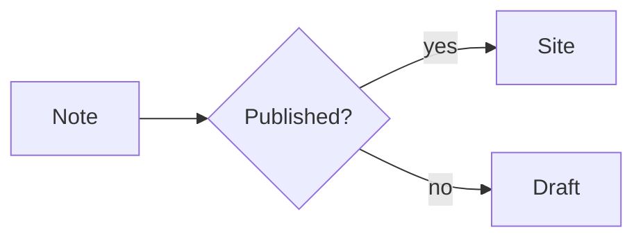
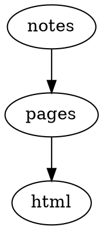
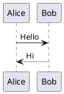

# Plugin reference

Every plugin registered by this preset, with the factory and options
used in `riebeckite.config.ts`. Full documentation lives in each package
README.

| Package | Factory | Options |
| --- | --- | --- |
| [`@riebeckite/plugin-obsidian-markdown`](https://github.com/Rerurate514/riebeckite/blob/main/packages/plugins/obsidian-markdown/README.md) | `obsidianMarkdown` | — |
| [`@riebeckite/plugin-color-mode`](https://github.com/Rerurate514/riebeckite/blob/main/packages/plugins/color-mode/README.md) | `colorModePlugin` | — |
| [`@riebeckite/plugin-l10n`](https://github.com/Rerurate514/riebeckite/blob/main/packages/plugins/l10n/README.md) | `l10n` | `{ defaultLang: "en", languages: ["en","ja","zh-CN","es","de","fr","ko"] }` |
| [`@riebeckite/plugin-seo`](https://github.com/Rerurate514/riebeckite/blob/main/packages/plugins/seo/README.md) | `seo` | `{ sitemap: true, robots: true, feed: { rss: true, atom: true, json: true } }` |
| [`@riebeckite/plugin-toc`](https://github.com/Rerurate514/riebeckite/blob/main/packages/plugins/toc/README.md) | `tocPlugin` | — |
| [`@riebeckite/plugin-properties`](https://github.com/Rerurate514/riebeckite/blob/main/packages/plugins/properties/README.md) | `properties` | `{ render: "slot", include: ["created", "modified", "tags", "status"], order: ["created", "modified", "tags", "status"] }` |
| [`@riebeckite/plugin-alias`](https://github.com/Rerurate514/riebeckite/blob/main/packages/plugins/alias/README.md) | `aliasPlugin` | `{ status: 308 }` |
| [`@riebeckite/plugin-code-enhance`](https://github.com/Rerurate514/riebeckite/blob/main/packages/plugins/code-enhance/README.md) | `codeEnhance` | `{ lineNumbers: true, copyButton: true, filename: true, lineHighlight: true, diffHighlight: true, theme: { light: "github-light", dark: "github-dark" }, wrapToggle: true }` |
| [`@riebeckite/plugin-search`](https://github.com/Rerurate514/riebeckite/blob/main/packages/plugins/search/README.md) | `searchPlugin` | — |
| [`@riebeckite/plugin-backlinks`](https://github.com/Rerurate514/riebeckite/blob/main/packages/plugins/backlinks/README.md) | `backlinksPlugin` | — |
| [`@riebeckite/plugin-breadcrumbs`](https://github.com/Rerurate514/riebeckite/blob/main/packages/plugins/breadcrumbs/README.md) | `breadcrumbsPlugin` | — |
| [`@riebeckite/plugin-navigation`](https://github.com/Rerurate514/riebeckite/blob/main/packages/plugins/navigation/README.md) | `navigation` | `{ items: [{ label: "Guide", href: "/guide" }, { label: "Examples", href: "/examples" }, { label: "Framework", href: "/framework/plugins", children: [{ label: "Plugins", href: "/framework/plugins" }, { label: "Themes", href: "/framework/themes" }] }], secondary: [{ label: "Guide", href: "/guide" }, { label: "Examples", href: "/examples" }] }` |
| [`@riebeckite/plugin-related-posts`](https://github.com/Rerurate514/riebeckite/blob/main/packages/plugins/related-posts/README.md) | `relatedPosts` | `{ limit: 5, useTags: true, useBacklinks: true, minScore: 1, heading: true, headingText: "Related", className: "rb-related-posts" }` |
| [`@riebeckite/plugin-share`](https://github.com/Rerurate514/riebeckite/blob/main/packages/plugins/share/README.md) | `share` | `{ placement: "bottom", services: ["x", "bluesky", "mastodon", "facebook", "linkedin", "hatena", "copy"], mastodonInstance: "mastodon.social" }` |
| [`@riebeckite/plugin-changelog`](https://github.com/Rerurate514/riebeckite/blob/main/packages/plugins/changelog/README.md) | `changelog` | `{ perNote: true, lookbackDays: 90, dateFormat: "iso", siteWide: false }` |
| [`@riebeckite/plugin-webmention`](https://github.com/Rerurate514/riebeckite/blob/main/packages/plugins/webmention/README.md) | `webmention` | `{ headingText: "Mentions", limit: 20 }` |
| [`@riebeckite/plugin-recent-posts`](https://github.com/Rerurate514/riebeckite/blob/main/packages/plugins/recent-posts/README.md) | `recentPostsPlugin` | — |
| [`@riebeckite/plugin-attachment`](https://github.com/Rerurate514/riebeckite/blob/main/packages/plugins/attachment/README.md) | `attachment` | `{ showSize: true }` |
| [`@riebeckite/plugin-pdf`](https://github.com/Rerurate514/riebeckite/blob/main/packages/plugins/pdf/README.md) | `pdf` | `{ height: "640px", initialPage: 1, toolbar: true, showMetadata: true, downloadLabel: "Download PDF" }` |
| [`@riebeckite/plugin-media`](https://github.com/Rerurate514/riebeckite/blob/main/packages/plugins/media/README.md) | `media` | `{ preload: "metadata", lazy: true, showCaption: true, showDownload: false, showOpenOriginal: true }` |
| [`@riebeckite/plugin-responsive-image`](https://github.com/Rerurate514/riebeckite/blob/main/packages/plugins/responsive-image/README.md) | `responsiveImage` | `{ lazy: true, decoding: true, sizes: "100vw", widths: [640, 1280, 1920], formats: ["webp", "avif"], className: "rb-responsive-image" }` |
| [`@riebeckite/plugin-lightbox`](https://github.com/Rerurate514/riebeckite/blob/main/packages/plugins/lightbox/README.md) | `lightboxPlugin` | `{ selectorClass: "rr-lightbox-trigger" }` |
| [`@riebeckite/plugin-highlight`](https://github.com/Rerurate514/riebeckite/blob/main/packages/plugins/highlight/README.md) | `highlight` | `{ tag: "mark", className: "rb-mark" }` |
| [`@riebeckite/plugin-code-tabs`](https://github.com/Rerurate514/riebeckite/blob/main/packages/plugins/code-tabs/README.md) | `codeTabs` | `{ syncTabs: true }` |
| [`@riebeckite/plugin-code-annotations`](https://github.com/Rerurate514/riebeckite/blob/main/packages/plugins/code-annotations/README.md) | `codeAnnotations` | `{ className: "rb-code" }` |
| [`@riebeckite/plugin-shortcodes`](https://github.com/Rerurate514/riebeckite/blob/main/packages/plugins/shortcodes/README.md) | `shortcodes` | `{ builtins: true }` |
| [`@riebeckite/plugin-series`](https://github.com/Rerurate514/riebeckite/blob/main/packages/plugins/series/README.md) | `series` | `{ key: "series", orderKey: "series_order", titleKey: "series_title", positionLabel: false, heading: true, className: "rb-series" }` |
| [`@riebeckite/plugin-taxonomy`](https://github.com/Rerurate514/riebeckite/blob/main/packages/plugins/taxonomy/README.md) | `taxonomy` | `{ tags: true, folders: true, related: true, feeds: { rss: true, atom: true, json: true }, relatedLimit: 8 }` |
| [`@riebeckite/plugin-folder-pages`](https://github.com/Rerurate514/riebeckite/blob/main/packages/plugins/folder-pages/README.md) | `folderPagesPlugin` | — |
| [`@riebeckite/plugin-autocardlink`](https://github.com/Rerurate514/riebeckite/blob/main/packages/plugins/autocardlink/README.md) | `autoCardLinkPlugin` | `{ className: "rb-cardlink" }` |
| [`@riebeckite/plugin-rich-embed`](https://github.com/Rerurate514/riebeckite/blob/main/packages/plugins/rich-embed/README.md) | `richEmbed` | `{ providers: ["youtube", "vimeo", "spotify"] }` |
| [`@riebeckite/plugin-gallery`](https://github.com/Rerurate514/riebeckite/blob/main/packages/plugins/gallery/README.md) | `gallery` | `{ columns: 3, aspect: "4/3", language: "gallery" }` |
| [`@riebeckite/plugin-mermaid`](https://github.com/Rerurate514/riebeckite/blob/main/packages/plugins/mermaid/README.md) | `mermaid` | `{ render: "build", theme: { light: "default", dark: "dark" }, caption: true, fallback: true }` |
| [`@riebeckite/plugin-graphviz`](https://github.com/Rerurate514/riebeckite/blob/main/packages/plugins/graphviz/README.md) | `graphviz` | `{ render: "build", engine: "dot", caption: true, fallback: true }` |
| [`@riebeckite/plugin-d2`](https://github.com/Rerurate514/riebeckite/blob/main/packages/plugins/d2/README.md) | `d2` | `{ render: "build", theme: { light: 0, dark: 1 }, layout: "dagre", caption: true }` |
| [`@riebeckite/plugin-plantuml`](https://github.com/Rerurate514/riebeckite/blob/main/packages/plugins/plantuml/README.md) | `plantuml` | `{ server: "https://www.plantuml.com/plantuml", format: "svg", caption: true, fallback: true }` |
| [`@riebeckite/plugin-chartjs`](https://github.com/Rerurate514/riebeckite/blob/main/packages/plugins/chartjs/README.md) | `chartjs` | `{ responsive: true, caption: true, className: "rb-chartjs" }` |
| [`@riebeckite/plugin-vega-lite`](https://github.com/Rerurate514/riebeckite/blob/main/packages/plugins/vega-lite/README.md) | `vegaLite` | `{ caption: true, theme: "light", renderer: "canvas", actions: false, className: "rb-vega-lite" }` |
| [`@riebeckite/plugin-wavedrom`](https://github.com/Rerurate514/riebeckite/blob/main/packages/plugins/wavedrom/README.md) | `wavedrom` | `{ skin: "default", caption: true, fallback: true, className: "rb-wavedrom" }` |
| [`@riebeckite/plugin-markmap`](https://github.com/Rerurate514/riebeckite/blob/main/packages/plugins/markmap/README.md) | `markmap` | `{ caption: true, height: 320, colorFreezeLevel: 2 }` |
| [`@riebeckite/plugin-map`](https://github.com/Rerurate514/riebeckite/blob/main/packages/plugins/map/README.md) | `map` | `{ zoom: 13, height: 320, tileUrl: "https://tile.openstreetmap.org/{z}/{x}/{y}.png", attribution: "&copy; <a href=\"https://www.openstreetmap.org/copyright\">OpenStreetMap</a> contributors" }` |
| [`@riebeckite/plugin-marp`](https://github.com/Rerurate514/riebeckite/blob/main/packages/plugins/marp/README.md) | `marp` | `{ theme: "default", allowHtml: true, math: true, caption: true }` |
| [`@riebeckite/plugin-qr-code`](https://github.com/Rerurate514/riebeckite/blob/main/packages/plugins/qr-code/README.md) | `qrCode` | `{ level: "M", margin: 1, width: 160, dark: "#000000", light: "#ffffff", caption: true, className: "rb-qr" }` |
| [`@riebeckite/plugin-discord-embed`](https://github.com/Rerurate514/riebeckite/blob/main/packages/plugins/discord-embed/README.md) | `discordEmbed` | `{ themeColor: "#5865F2", imageAlt: true, imageDimensions: true }` |
| [`@riebeckite/plugin-excalidraw`](https://github.com/Rerurate514/riebeckite/blob/main/packages/plugins/excalidraw/README.md) | `excalidraw` | `{ lazy: true }` |
| [`@riebeckite/plugin-excalibrain`](https://github.com/Rerurate514/riebeckite/blob/main/packages/plugins/excalibrain/README.md) | `excaliBrain` | `{ render: "build", auto: true, heading: true, infer: true, siblings: true, headingText: "ExcaliBrain", width: 720, height: 480 }` |
| [`@riebeckite/plugin-canvas`](https://github.com/Rerurate514/riebeckite/blob/main/packages/plugins/canvas/README.md) | `canvas` | `{ language: "canvas", render: "both", className: "rb-canvas" }` |
| [`@riebeckite/plugin-bases`](https://github.com/Rerurate514/riebeckite/blob/main/packages/plugins/bases/README.md) | `bases` | `{ language: "base", limit: 100, className: "rb-bases", showFallback: true }` |
| [`@riebeckite/plugin-dataview`](https://github.com/Rerurate514/riebeckite/blob/main/packages/plugins/dataview/README.md) | `dataviewPlugin` | `{ limit: 50, className: "rb-dataview", hideFallback: false }` |
| [`@riebeckite/plugin-flashcards`](https://github.com/Rerurate514/riebeckite/blob/main/packages/plugins/flashcards/README.md) | `flashcardsPlugin` | `{ shuffle: true, fallback: true, className: "rb-flashcards" }` |
| [`@riebeckite/plugin-kanban`](https://github.com/Rerurate514/riebeckite/blob/main/packages/plugins/kanban/README.md) | `kanban` | `{ columnMarker: "##", autoDetect: true, className: "rb-kanban", fallback: true }` |
| [`@riebeckite/plugin-query`](https://github.com/Rerurate514/riebeckite/blob/main/packages/plugins/query/README.md) | `queryPlugin` | `{ defaultFormat: "list", defaultLimit: 50, className: "rb-query", excludeSelf: true }` |
| [`@riebeckite/plugin-local-graph`](https://github.com/Rerurate514/riebeckite/blob/main/packages/plugins/local-graph/README.md) | `localGraphPlugin` | — |
| [`@riebeckite/plugin-hover-preview`](https://github.com/Rerurate514/riebeckite/blob/main/packages/plugins/hover-preview/README.md) | `hoverPreviewPlugin` | `{ delay: 120, excerptLength: 160, selector: 'a[href^="/"]', includeTitles: true }` |
| [`@riebeckite/plugin-garden-explorer`](https://github.com/Rerurate514/riebeckite/blob/main/packages/plugins/garden-explorer/README.md) | `gardenExplorerPlugin` | — |
| [`@riebeckite/plugin-ux`](https://github.com/Rerurate514/riebeckite/blob/main/packages/plugins/ux/README.md) | `uxPlugin` | `{ progress: true, backToTop: true, tocScrollSpy: true, codeCopy: true }` |
| [`@riebeckite/plugin-daily-notes`](https://github.com/Rerurate514/riebeckite/blob/main/packages/plugins/daily-notes/README.md) | `dailyNotesPlugin` | `{ source: { directory: "Daily", pathPattern: "Daily/{YYYY}-{MM}-{DD}" }, extract: { frontmatter: "daily-summary", codeBlock: "daily-snippet" }, widget: { limit: 5 } }` |
| [`@riebeckite/plugin-rename`](https://github.com/Rerurate514/riebeckite/blob/main/packages/plugins/rename/README.md) | `renamePlugin` | `{ enabled: true, status: 308, onUnexpectedRemoval: "warning" }` |
| [`@riebeckite/plugin-text-fragment`](https://github.com/Rerurate514/riebeckite/blob/main/packages/plugins/text-fragment/README.md) | `textFragmentPlugin` | `{ prefix: "showcase: " }` |
| [`@riebeckite/plugin-quality`](https://github.com/Rerurate514/riebeckite/blob/main/packages/plugins/quality/README.md) | `qualityPlugin` | `{ a11y: { enabled: true }, ignoreRules: [] }` |
| [`@riebeckite/plugin-deploy`](https://github.com/Rerurate514/riebeckite/blob/main/packages/plugins/deploy/README.md) | `deployPlugin` | `{ provider: "cloudflare-pages" }` |
| [`@riebeckite/plugin-diagnostics`](https://github.com/Rerurate514/riebeckite/blob/main/packages/plugins/diagnostics/README.md) | `diagnostics` | `{ reportUnusedAssets: true, reportOrphans: true, requiredFrontmatter: ["title"] }` |

## Markdown behavior

Every registered plugin is listed below with the Markdown that triggers it,
or with the Markdown/frontmatter/content shape it reads when the plugin is
site-wide rather than block-based. Paste the examples into files under
`content/` and run `npm exec riebeckite dev` to inspect the rendered result.

### @riebeckite/plugin-obsidian-markdown

Factory: `obsidianMarkdown` · [README](https://github.com/Rerurate514/riebeckite/blob/main/packages/plugins/obsidian-markdown/README.md)

#### Callouts

A block quote with a `[!type]` marker becomes a styled callout panel.

> [!tip] Try it
> A callout is a block quote with a `[!type]` marker. `[!info]`,
> `[!warning]`, and `[!question]` render the same way.

#### Wikilinks and embeds

`[[...]]` links and `![[...]]` embeds resolve to real permalinks from the content manifest.

Read the [[guide]] and [[index]] pages. `![[index]]` embeds the note inline.

### @riebeckite/plugin-color-mode

Factory: `colorModePlugin` · [README](https://github.com/Rerurate514/riebeckite/blob/main/packages/plugins/color-mode/README.md)

Adds the light/dark/system color-mode control to the app shell. Markdown does not need special syntax; every page inherits the toggle.

Write any page normally. Use the color-mode control in the header to see the same Markdown under light and dark tokens.

### @riebeckite/plugin-l10n

Factory: `l10n` · [README](https://github.com/Rerurate514/riebeckite/blob/main/packages/plugins/l10n/README.md)

Routes translated Markdown files by language suffix and keeps the default-language file unsuffixed.

```text
content/about.md       # default language
content/about.ja.md    # Japanese version served under /ja/about/
content/about.fr.md    # French version served under /fr/about/
```

### @riebeckite/plugin-seo

Factory: `seo` · [README](https://github.com/Rerurate514/riebeckite/blob/main/packages/plugins/seo/README.md)

Turns Markdown frontmatter and site config into metadata, feeds, sitemap, and robots output.

---
title: Search-friendly title
description: Page-specific summary used for meta tags and cards.
image: /ogp/page.png
date: 2026-09-30
publish: true
---

# Search-friendly title

### @riebeckite/plugin-toc

Factory: `tocPlugin` · [README](https://github.com/Rerurate514/riebeckite/blob/main/packages/plugins/toc/README.md)

Builds a table of contents from Markdown headings.

# Page

## First section

### Nested section

## Second section

### @riebeckite/plugin-properties

Factory: `properties` · [README](https://github.com/Rerurate514/riebeckite/blob/main/packages/plugins/properties/README.md)

Renders selected frontmatter properties in the article metadata slot.

---
created: 2026-09-30
modified: 2026-09-30
tags: [riebeckite, demo]
status: active
---

### @riebeckite/plugin-alias

Factory: `aliasPlugin` · [README](https://github.com/Rerurate514/riebeckite/blob/main/packages/plugins/alias/README.md)

Creates redirects from old Markdown paths declared in frontmatter.

---
aliases:
  - /old-page/
  - /notes/previous-name/
---

### @riebeckite/plugin-code-enhance

Factory: `codeEnhance` · [README](https://github.com/Rerurate514/riebeckite/blob/main/packages/plugins/code-enhance/README.md)

#### Code with a toolbar

Code fences get line numbers, a filename bar, line highlighting, and a copy button.

```ts
// Syntax highlighting, line numbers, and a copy button
export function hello(name: string): string {
  return "Hello, " + name + "!";
}
```

### @riebeckite/plugin-search

Factory: `searchPlugin` · [README](https://github.com/Rerurate514/riebeckite/blob/main/packages/plugins/search/README.md)

Indexes published Markdown pages for client-side search. No special syntax is required; searchable text comes from each page body and metadata.

# Indexed page

This body text becomes searchable after the site is built.

### @riebeckite/plugin-backlinks

Factory: `backlinksPlugin` · [README](https://github.com/Rerurate514/riebeckite/blob/main/packages/plugins/backlinks/README.md)

Shows pages that link to the current page. Use normal Markdown links or Obsidian wikilinks.

Mention another page with [[guide]] or [the guide](/guide/). The target page can show this page as a backlink.

### @riebeckite/plugin-breadcrumbs

Factory: `breadcrumbsPlugin` · [README](https://github.com/Rerurate514/riebeckite/blob/main/packages/plugins/breadcrumbs/README.md)

This plugin has no Markdown-specific demo in the scaffold yet. See its package README for the exact behavior and options.

### @riebeckite/plugin-navigation

Factory: `navigation` · [README](https://github.com/Rerurate514/riebeckite/blob/main/packages/plugins/navigation/README.md)

This plugin has no Markdown-specific demo in the scaffold yet. See its package README for the exact behavior and options.

### @riebeckite/plugin-related-posts

Factory: `relatedPosts` · [README](https://github.com/Rerurate514/riebeckite/blob/main/packages/plugins/related-posts/README.md)

Finds related pages from tags and backlink relationships.

---
tags: [typescript, static-site]
---

Link to [[another-note]] to strengthen the relationship.

### @riebeckite/plugin-share

Factory: `share` · [README](https://github.com/Rerurate514/riebeckite/blob/main/packages/plugins/share/README.md)

Adds share links to rendered pages. Markdown does not need special syntax; page title and URL are used automatically.

---
title: Shareable article
---

# Shareable article

### @riebeckite/plugin-changelog

Factory: `changelog` · [README](https://github.com/Rerurate514/riebeckite/blob/main/packages/plugins/changelog/README.md)

Surfaces recent or per-note update information from Markdown metadata.

---
title: Updated article
modified: 2026-09-30
---

### @riebeckite/plugin-webmention

Factory: `webmention` · [README](https://github.com/Rerurate514/riebeckite/blob/main/packages/plugins/webmention/README.md)

Displays webmentions for the page URL when data is available. Markdown controls the canonical page metadata.

---
title: Mentionable page
canonical: https://example.com/mentionable-page/
---

### @riebeckite/plugin-recent-posts

Factory: `recentPostsPlugin` · [README](https://github.com/Rerurate514/riebeckite/blob/main/packages/plugins/recent-posts/README.md)

Builds recent-post lists from dated Markdown entries.

---
title: New post
date: 2026-09-30
publish: true
---

### @riebeckite/plugin-attachment

Factory: `attachment` · [README](https://github.com/Rerurate514/riebeckite/blob/main/packages/plugins/attachment/README.md)

Enhances links to downloadable assets, including size display when enabled.

Download the handout: [slides.pdf](/attachments/slides.pdf)

### @riebeckite/plugin-pdf

Factory: `pdf` · [README](https://github.com/Rerurate514/riebeckite/blob/main/packages/plugins/pdf/README.md)

Embeds linked PDFs with a viewer/fallback UI.


### @riebeckite/plugin-media

Factory: `media` · [README](https://github.com/Rerurate514/riebeckite/blob/main/packages/plugins/media/README.md)

Enhances Markdown audio/video embeds with lazy loading and captions.


### @riebeckite/plugin-responsive-image

Factory: `responsiveImage` · [README](https://github.com/Rerurate514/riebeckite/blob/main/packages/plugins/responsive-image/README.md)

Rewrites Markdown image embeds into responsive images with configured widths and formats.


### @riebeckite/plugin-lightbox

Factory: `lightboxPlugin` · [README](https://github.com/Rerurate514/riebeckite/blob/main/packages/plugins/lightbox/README.md)

Makes image links open in a lightbox when the configured trigger class is present.

[](./images/photo.jpg){.rr-lightbox-trigger}

### @riebeckite/plugin-highlight

Factory: `highlight` · [README](https://github.com/Rerurate514/riebeckite/blob/main/packages/plugins/highlight/README.md)

Highlights marked inline text.

This sentence contains ==highlighted text== inside normal Markdown.

### @riebeckite/plugin-code-tabs

Factory: `codeTabs` · [README](https://github.com/Rerurate514/riebeckite/blob/main/packages/plugins/code-tabs/README.md)

#### Code tabs

Adjacent `tab="..."` fences become one tabbed group; `syncTabs: true` keeps the same label in sync across groups.

```ts tab="React"
const greeting = "Hello from React";
```
```js tab="Vanilla"
console.log("Hello from JavaScript");
```

### @riebeckite/plugin-code-annotations

Factory: `codeAnnotations` · [README](https://github.com/Rerurate514/riebeckite/blob/main/packages/plugins/code-annotations/README.md)

Adds callouts/annotations to code fences.

```ts
const answer = 42 // [!code focus]
console.log(answer)
```

### @riebeckite/plugin-shortcodes

Factory: `shortcodes` · [README](https://github.com/Rerurate514/riebeckite/blob/main/packages/plugins/shortcodes/README.md)

Expands built-in shortcode syntax inside Markdown.

::youtube[id=dQw4w9WgXcQ]

::figure[Demo image]{src="/images/demo.png"}

### @riebeckite/plugin-series

Factory: `series` · [README](https://github.com/Rerurate514/riebeckite/blob/main/packages/plugins/series/README.md)

Groups Markdown pages into a reading series using frontmatter.

---
series: riebeckite-guide
series_title: Riebeckite Guide
series_order: 2
---

### @riebeckite/plugin-taxonomy

Factory: `taxonomy` · [README](https://github.com/Rerurate514/riebeckite/blob/main/packages/plugins/taxonomy/README.md)

Builds tag/folder taxonomy pages from Markdown metadata and content location.

---
tags: [design, notes]
---

# Tagged note

### @riebeckite/plugin-folder-pages

Factory: `folderPagesPlugin` · [README](https://github.com/Rerurate514/riebeckite/blob/main/packages/plugins/folder-pages/README.md)

This plugin has no Markdown-specific demo in the scaffold yet. See its package README for the exact behavior and options.

### @riebeckite/plugin-autocardlink

Factory: `autoCardLinkPlugin` · [README](https://github.com/Rerurate514/riebeckite/blob/main/packages/plugins/autocardlink/README.md)

Turns suitable standalone links into rich card links.

https://example.com/articles/riebeckite-introduction

### @riebeckite/plugin-rich-embed

Factory: `richEmbed` · [README](https://github.com/Rerurate514/riebeckite/blob/main/packages/plugins/rich-embed/README.md)

#### Rich embeds

An `embed` fence turns a URL into a YouTube, Vimeo, Spotify, CodePen, or Gist embed.

```embed
https://www.youtube.com/watch?v=dQw4w9WgXcQ
title: Demo video
caption: A short caption
aspect: 16/9
```

### @riebeckite/plugin-gallery

Factory: `gallery` · [README](https://github.com/Rerurate514/riebeckite/blob/main/packages/plugins/gallery/README.md)

#### Gallery cards

A `gallery` YAML fence renders a responsive grid of cards — handy for theme or project showcases.

```gallery
columns: 3
items:
  - title: Default
    description: A clean, typographic theme.
    meta: v0.0.5
    href: https://riebeckite.dev/docs/themes/default
  - title: Minimal
    description: Stripped back to the essentials.
    meta: v0.0.5
    href: https://riebeckite.dev/docs/themes/minimal
  - title: Gruvbox
    description: A warm, high-contrast palette.
    meta: v0.0.5
    href: https://riebeckite.dev/docs/themes/gruvbox
```

### @riebeckite/plugin-mermaid

Factory: `mermaid` · [README](https://github.com/Rerurate514/riebeckite/blob/main/packages/plugins/mermaid/README.md)

#### Mermaid

A `mermaid` fence becomes a rendered diagram at build time.



### @riebeckite/plugin-graphviz

Factory: `graphviz` · [README](https://github.com/Rerurate514/riebeckite/blob/main/packages/plugins/graphviz/README.md)

#### Graphviz / DOT

A `dot` fence is rendered with a configurable engine (here `dot`).



### @riebeckite/plugin-d2

Factory: `d2` · [README](https://github.com/Rerurate514/riebeckite/blob/main/packages/plugins/d2/README.md)

#### D2

A `d2` fence is compiled into an SVG diagram.

```d2
site: Riebeckite
  content -> build -> deploy
```

### @riebeckite/plugin-plantuml

Factory: `plantuml` · [README](https://github.com/Rerurate514/riebeckite/blob/main/packages/plugins/plantuml/README.md)

A `plantuml` fence is rendered to SVG through the configured PlantUML server.



### @riebeckite/plugin-chartjs

Factory: `chartjs` · [README](https://github.com/Rerurate514/riebeckite/blob/main/packages/plugins/chartjs/README.md)

#### Chart.js

A `chart` JSON fence renders with Chart.js; a caption comes from the block `title`.

```chart
{
  "type": "bar",
  "data": {
    "labels": ["Mon", "Tue", "Wed"],
    "datasets": [{ "label": "Visits", "data": [12, 19, 8] }]
  }
}
```

### @riebeckite/plugin-vega-lite

Factory: `vegaLite` · [README](https://github.com/Rerurate514/riebeckite/blob/main/packages/plugins/vega-lite/README.md)

#### Vega-Lite

A `vega-lite` JSON specification becomes a Vega chart.

```vega-lite
{
  "title": "Revenue",
  "data": {
    "values": [
      { "category": "A", "value": 28 },
      { "category": "B", "value": 55 }
    ]
  },
  "mark": "bar",
  "encoding": {
    "x": { "field": "category", "type": "nominal" },
    "y": { "field": "value", "type": "quantitative" }
  }
}
```

### @riebeckite/plugin-wavedrom

Factory: `wavedrom` · [README](https://github.com/Rerurate514/riebeckite/blob/main/packages/plugins/wavedrom/README.md)

#### WaveDrom

A `wavedrom` JSON fence becomes a digital timing diagram.

```wavedrom
{
  "signal": [
    { "name": "clk", "wave": "p......" },
    { "name": "bus", "wave": "x.34.5x", "data": "head body tail" }
  ]
}
```

### @riebeckite/plugin-markmap

Factory: `markmap` · [README](https://github.com/Rerurate514/riebeckite/blob/main/packages/plugins/markmap/README.md)

#### Markmap

A `markmap` fence turns its heading outline into an interactive mind map.

```markmap
# Project

## Design

### Notation
### Rendering

## Delivery
```

### @riebeckite/plugin-map

Factory: `map` · [README](https://github.com/Rerurate514/riebeckite/blob/main/packages/plugins/map/README.md)

#### Maps

A `map` fence embeds an OpenStreetMap: a static fallback (coordinates and links) first, upgraded to an interactive map when JavaScript is available.

```map
center: 35.6812, 139.7671
zoom: 13
label: Tokyo Station
markers:
  - 35.6812, 139.7671 | Tokyo Station
  - 35.6586, 139.7454 | Tokyo Tower
```

### @riebeckite/plugin-marp

Factory: `marp` · [README](https://github.com/Rerurate514/riebeckite/blob/main/packages/plugins/marp/README.md)

#### Marp slides

A `marp` fence renders slides, separated by `---`.

```marp title="Intro deck"
# First slide

- a bullet

---

# Second slide
```

### @riebeckite/plugin-qr-code

Factory: `qrCode` · [README](https://github.com/Rerurate514/riebeckite/blob/main/packages/plugins/qr-code/README.md)

#### QR codes

A `qr` fence becomes an inline SVG QR code, encoded entirely at build time.

```qr
# caption: Project page
https://example.com/
```

### @riebeckite/plugin-discord-embed

Factory: `discordEmbed` · [README](https://github.com/Rerurate514/riebeckite/blob/main/packages/plugins/discord-embed/README.md)

Renders Discord-style rich embed metadata from frontmatter or embed blocks.

---
title: Discord preview
description: A page with rich metadata for card rendering.
image: /images/card.png
---

### @riebeckite/plugin-excalidraw

Factory: `excalidraw` · [README](https://github.com/Rerurate514/riebeckite/blob/main/packages/plugins/excalidraw/README.md)

Embeds Excalidraw drawings referenced from Markdown.

![[Architecture.excalidraw]]


### @riebeckite/plugin-excalibrain

Factory: `excaliBrain` · [README](https://github.com/Rerurate514/riebeckite/blob/main/packages/plugins/excalibrain/README.md)

Builds an Excalibrain-style local graph from links, tags, headings, and inferred relationships.

# Concept

Links to [[Parent idea]], [[Sibling idea]], and [[Related idea]] become graph relationships.

### @riebeckite/plugin-canvas

Factory: `canvas` · [README](https://github.com/Rerurate514/riebeckite/blob/main/packages/plugins/canvas/README.md)

Embeds Obsidian Canvas JSON as a rendered canvas/fallback.

```canvas
{ "nodes": [], "edges": [] }
```

### @riebeckite/plugin-bases

Factory: `bases` · [README](https://github.com/Rerurate514/riebeckite/blob/main/packages/plugins/bases/README.md)

#### Base views

A `base` YAML fence renders a Base table view.

```base
filters:
  and:
    - file.hasTag("featured")
properties:
  file.name:
    displayName: Title
views:
  - type: table
    name: Featured
    limit: 10
```

### @riebeckite/plugin-dataview

Factory: `dataviewPlugin` · [README](https://github.com/Rerurate514/riebeckite/blob/main/packages/plugins/dataview/README.md)

#### Dataview

A `dataview` query renders a table of notes from the manifest.

```dataview
TABLE file.name AS "Name", status
FROM #project
WHERE status = "active"
SORT file.name asc
LIMIT 10
```

### @riebeckite/plugin-flashcards

Factory: `flashcardsPlugin` · [README](https://github.com/Rerurate514/riebeckite/blob/main/packages/plugins/flashcards/README.md)

Turns Q/A style Markdown into flashcards.

# Flashcards

Q: What is Riebeckite?
A: A content-first static site framework.

---

What does SSG mean?::Static Site Generation

### @riebeckite/plugin-kanban

Factory: `kanban` · [README](https://github.com/Rerurate514/riebeckite/blob/main/packages/plugins/kanban/README.md)

#### Kanban boards

A note whose body is `##` columns of task lists becomes a board; `#tags` and `[[wikilinks]]` work inside cards.

```md
## Backlog

- [ ] Draft the release notes
- [ ] Link to [[index]]

## Done

- [x] Publish the fixture
```

### @riebeckite/plugin-query

Factory: `queryPlugin` · [README](https://github.com/Rerurate514/riebeckite/blob/main/packages/plugins/query/README.md)

#### Query

A `query` fence is YAML that filters and sorts entries from the manifest.

```query
filter:
  tags:
    any: [diary]
sort:
  field: date
  order: desc
limit: 5
```

### @riebeckite/plugin-local-graph

Factory: `localGraphPlugin` · [README](https://github.com/Rerurate514/riebeckite/blob/main/packages/plugins/local-graph/README.md)

Shows nearby notes based on Markdown links and wikilinks.

# Local graph source

Connect this page to [[guide]], [[examples]], and [[reference/plugins]].

### @riebeckite/plugin-hover-preview

Factory: `hoverPreviewPlugin` · [README](https://github.com/Rerurate514/riebeckite/blob/main/packages/plugins/hover-preview/README.md)

Shows previews when hovering internal links generated from Markdown.

Hover this internal link: [Guide](/guide/) or this wikilink: [[guide]].

### @riebeckite/plugin-garden-explorer

Factory: `gardenExplorerPlugin` · [README](https://github.com/Rerurate514/riebeckite/blob/main/packages/plugins/garden-explorer/README.md)

Adds garden navigation/explorer UI from the content tree. Markdown files and folders become the source data.

```text
content/
  notes/
    ideas.md
    projects.md
  reference/
    plugins.md
```

### @riebeckite/plugin-ux

Factory: `uxPlugin` · [README](https://github.com/Rerurate514/riebeckite/blob/main/packages/plugins/ux/README.md)

Adds reading UX such as progress, back-to-top, scroll spy, and copy buttons. Markdown headings and code blocks provide the anchors.

## Long section

```ts
console.log('copy me')
```

### @riebeckite/plugin-daily-notes

Factory: `dailyNotesPlugin` · [README](https://github.com/Rerurate514/riebeckite/blob/main/packages/plugins/daily-notes/README.md)

Extracts daily-note summaries/snippets from dated Markdown files.

---
daily-summary: Shipped the plugin reference page.
---

```daily-snippet
Updated the showcase examples.
```

### @riebeckite/plugin-rename

Factory: `renamePlugin` · [README](https://github.com/Rerurate514/riebeckite/blob/main/packages/plugins/rename/README.md)

Creates redirects when Markdown entries declare previous paths or when rename data is available.

---
previousPaths:
  - /old-slug/
  - /notes/old-title/
---

### @riebeckite/plugin-text-fragment

Factory: `textFragmentPlugin` · [README](https://github.com/Rerurate514/riebeckite/blob/main/packages/plugins/text-fragment/README.md)

Adds text-fragment friendly copy/open behavior for selected Markdown text.

Select this sentence in the rendered page and copy a text-fragment link to it.

### @riebeckite/plugin-quality

Factory: `qualityPlugin` · [README](https://github.com/Rerurate514/riebeckite/blob/main/packages/plugins/quality/README.md)

Reports accessibility/content quality diagnostics from rendered Markdown output.


Use headings in order: #, then ##, then ###.

### @riebeckite/plugin-deploy

Factory: `deployPlugin` · [README](https://github.com/Rerurate514/riebeckite/blob/main/packages/plugins/deploy/README.md)

Adds deployment integration for the generated site. Markdown does not need syntax; published pages become deployable output.

---
publish: true
---

# This page is included in the deployed site

### @riebeckite/plugin-diagnostics

Factory: `diagnostics` · [README](https://github.com/Rerurate514/riebeckite/blob/main/packages/plugins/diagnostics/README.md)

Reports diagnostics such as missing required frontmatter, orphan pages, and unused assets.

---
title: Required title
publish: true
---

Link orphan pages from another note to clear orphan diagnostics.

[Riebeckite plugins on GitHub](https://github.com/Rerurate514/riebeckite/tree/main/packages/plugins)

